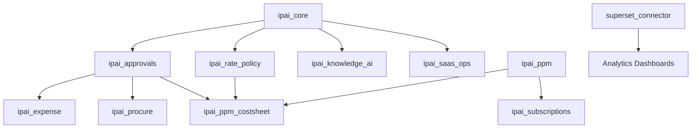

# InsightPulse Odoo – System Architecture

**Last Updated**: 2025-11-08
**Version**: 4.0.0 (Enterprise Structure)
**Target**: Odoo 18 CE + OCA
**Environment**: Production (DigitalOcean + Supabase)

---

## 📐 Architecture Overview

InsightPulse is a complete, self-hosted enterprise SaaS replacement suite providing 95% feature parity with commercial products at <5% of the cost. The architecture is built on **Odoo 18 CE + OCA** with integrated analytics (Apache Superset), AI agents (SuperClaude), and multi-tenant capabilities.

**Design Principles**:
1. **Self-hosted first**: Minimize SaaS dependencies, maximize cost savings
2. **BIR compliant**: Immutable accounting, audit trails, Philippine tax compliance
3. **Multi-tenant**: Per-legal-entity isolation (company_id, not department routing)
4. **OCA-aligned**: Prefer OCA modules over Enterprise, follow AGPL-3 standards
5. **AI-augmented**: Claude agents for deployment, testing, compliance checks

---

## 🏗️ System Components

### 1. Core ERP Layer (Odoo 18 CE)

```
insightpulse-odoo/
├── addons/
│   ├── insightpulse/               # Namespace modules
│   │   ├── finance/                # Finance SSC modules
│   │   │   ├── ipai_approvals/     # Epic 1: Unified approvals
│   │   │   ├── ipai_ppm_costsheet/ # Epic 2: Cost sheets
│   │   │   ├── ipai_rate_policy/   # Epic 3: Rate automation
│   │   │   ├── ipai_procure/       # Epic 4: Procurement (Ariba)
│   │   │   ├── ipai_expense/       # Epic 5: T&E (Concur)
│   │   │   ├── ipai_ppm/           # Epic 6: PPM (Clarity)
│   │   │   └── ipai_subscriptions/ # Epic 7: SaaS billing
│   │   └── ai/                     # AI integration
│   │       ├── ipai_knowledge_ai/  # Epic 8: Knowledge (Notion)
│   │       └── ipai_saas_ops/      # Epic 10: Multi-tenancy
│   └── vendor/                     # OCA modules (vendored)
└── odoo/                           # Odoo 18 CE core
```

**Tech Stack**:
- **Python**: 3.11+ (type hints, async support)
- **PostgreSQL**: 15+ (pgvector for AI)
- **Odoo**: 18.0 CE (NEVER 19, NEVER Enterprise)
- **OCA Modules**: `purchase_requisition`, `contract`, `hr_expense`, `document_knowledge`

---

### 2. Business Intelligence Layer

```
┌─────────────────────────────────────────────────┐
│ Apache Superset (Tableau Replacement)          │
│ - Cost: $0/year vs $8,400/year (Tableau)       │
│ - Features: Dashboards, SQL Lab, RLS           │
│ - Integration: Odoo PostgreSQL, Supabase DW    │
└─────────────────────────────────────────────────┘
           │
           ↓
┌─────────────────────────────────────────────────┐
│ Data Warehouse Layer (Supabase)                │
│ - PostgreSQL 15 + pgvector                     │
│ - MVs for KPIs (MRR/ARR, job profitability)    │
│ - ETL: Airbyte + DBT                            │
└─────────────────────────────────────────────────┘
           │
           ↓
┌─────────────────────────────────────────────────┐
│ Predictive Analytics (MindsDB)                 │
│ - Budget vs actual anomaly detection           │
│ - Vendor risk scoring                          │
│ - Cost sheet AI suggestions                    │
└─────────────────────────────────────────────────┘
```

**Key Metrics**:
- **Finance**: MRR, ARR, margin variance (≤±2%)
- **PPM**: Budget vs actual, job profitability, estimate→invoice cycle (≤5d)
- **Procurement**: Vendor scorecard, procurement cycle time, cost savings
- **Expenses**: Compliance rate (≥95%), processing time (<2d)

---

### 3. AI Agent Layer (SuperClaude)

```
┌─────────────────────────────────────────────────┐
│ Claude Code Orchestrator (Main Interface)      │
│ - Model: claude-sonnet-4-5-20250929            │
│ - Context: 200K tokens                          │
│ - Skills: 46 auto-linked                       │
└──────────────┬──────────────────────────────────┘
               │
    ┌──────────┴──────────┬─────────────┬──────────┐
    ↓                     ↓             ↓          ↓
┌──────────┐  ┌──────────────┐  ┌─────────┐  ┌────────┐
│  Odoo    │  │ Finance SSC  │  │   BI    │  │ DevOps │
│Developer │  │   Expert     │  │Architect│  │Engineer│
├──────────┤  ├──────────────┤  ├─────────┤  ├────────┤
│Skills:   │  │Skills:       │  │Skills:  │  │Skills: │
│-odoo     │  │-bir-filing   │  │-superset│  │-github │
│-scaffold │  │-finance-auto │  │-sql-dev │  │-docker │
│-testing  │  │-agency-ops   │  │-tableau │  │-deploy │
└──────────┘  └──────────────┘  └─────────┘  └────────┘
```

**Agent Definitions**:
- **odoo_developer**: Module scaffolding, testing, OCA compliance
- **finance_ssc_expert**: BIR forms (1601-C, 2550Q), multi-agency ops
- **bi_architect**: Superset dashboards, SQL optimization, RLS
- **devops_engineer**: DigitalOcean deployments, CI/CD, monitoring

**MCP Servers** (7 total):
1. `pulser-hub`: Odoo & ecosystem integration
2. `digitalocean`: App Platform management
3. `kubernetes`: Cluster operations
4. `docker`: Container management
5. `github`: Repository + CI/CD
6. `superset`: Analytics & dashboards
7. `tableau`: Legacy BI migration

---

### 4. Infrastructure Layer

```
┌───────────────────────────────────────────────────────┐
│ DigitalOcean App Platform (Production)                │
│ Region: SGP1 (Singapore)                              │
├───────────────────────────────────────────────────────┤
│                                                        │
│  ┌──────────────────┐  ┌─────────────────────────┐   │
│  │ pulse-hub-web    │  │ superset-analytics      │   │
│  │ ────────────     │  │ ──────────────────      │   │
│  │ Status: ✅       │  │ Status: ✅              │   │
│  │ Cost: $5/month   │  │ Cost: $27/month         │   │
│  │                  │  │                         │   │
│  │ Components:      │  │ Components:             │   │
│  │ - API (web)      │  │ - superset-web (xs)     │   │
│  │ - Static site    │  │ - worker (xxs)          │   │
│  │                  │  │ - beat (xxs)            │   │
│  │ Routes:          │  │ - redis (xxs)           │   │
│  │ • /              │  │                         │   │
│  │ • /webhook       │  │ Routes:                 │   │
│  │ • /health        │  │ • /superset             │   │
│  │                  │  │ • /health               │   │
│  │ Deploy: Auto     │  │                         │   │
│  │ (GitHub main)    │  │ Deploy: Auto            │   │
│  └──────────────────┘  └─────────────────────────┘   │
│                                                        │
│  ┌──────────────────────────────────────────────┐    │
│  │ pulser-hub-mcp                               │    │
│  │ ──────────────                               │    │
│  │ Status: ✅                                   │    │
│  │ Cost: $5/month                               │    │
│  │ MCP Operations: GitHub App (ID: 2191216)    │    │
│  └──────────────────────────────────────────────┘    │
│                                                        │
└───────────────────────────────────────────────────────┘
                        │
                        ↓
┌───────────────────────────────────────────────────────┐
│ Supabase (Database & Vector Store)                    │
│ Region: US East 1 (AWS)                               │
├───────────────────────────────────────────────────────┤
│ Project: spdtwktxdalcfigzeqrz                         │
│ Endpoint: aws-1-us-east-1.pooler.supabase.com:6543   │
│                                                        │
│ Usage:                                                 │
│ - Superset metadata storage                           │
│ - Data warehouse (MVs, analytics)                     │
│ - pgvector for AI knowledge workspace                 │
│ - Connection pooling (PgBouncer)                      │
│                                                        │
│ Cost: Free tier (up to 500MB)                         │
└───────────────────────────────────────────────────────┘
```

**Deployment Strategy**:
- **CI/CD**: GitHub Actions → DigitalOcean App Platform
- **Blue-Green**: Zero-downtime deployments
- **Rollback**: Git tags + module upgrade with `--stop-after-init`
- **Health Checks**: Prometheus + Grafana + Superset KPIs
- **Backups**: Auto daily backups to DigitalOcean Spaces

---

## 🔒 Security Architecture

### Multi-Tenancy Model

**Design**: Per-legal-entity isolation (NOT department routing)

```python
# ✅ Correct: Tenant isolation (legal entity)
company_id = fields.Many2one('res.company', required=True)

# Record rules enforce isolation
@api.model
def _search(self, args, offset=0, limit=None, order=None, count=False, access_rights_uid=None):
    args += [('company_id', '=', self.env.company.id)]
    return super()._search(args, offset, limit, order, count, access_rights_uid)

# ❌ Incorrect: Agency is NOT tenancy
agency_id = fields.Many2one('hr.department')  # internal only, no security boundary
```

### Access Control Matrix

| Role | Cost Sheets | Vendor Data | Budgets | Approvals | AI Workspace |
|------|-------------|-------------|---------|-----------|--------------|
| **Account Manager** | Read/Write | Hidden | Read | Submit | Read/Write |
| **Finance Director** | Read/Write | Full Access | Read/Write | Approve | Read |
| **Procurement Officer** | Read | Full Access | Read | Approve | Read |
| **Creative Lead** | Read | Hidden | Hidden | None | Read/Write |
| **Client Portal** | Read (Shared) | Hidden | Hidden | None | Read (Public) |

### BIR Compliance (Philippines)

**Immutable Accounting**:
```python
# ✅ Correct: Reversal + rebook
def action_correct(self, new_amount):
    # Create reversal entry
    self.copy({'amount': -self.amount, 'is_correction': True})
    # Create new entry
    return self.copy({'amount': new_amount})

# ❌ Incorrect: Direct mutation
def action_correct(self, new_amount):
    self.write({'amount': new_amount})  # FORBIDDEN for posted entries
```

**Audit Trail**:
- All financial models inherit `mail.thread`
- State changes logged via chatter (actor + timestamp)
- Journal entries produce immutable evidence

**BIR Forms**:
- **1601-C**: Monthly withholding tax remittance
- **2550Q**: Quarterly VAT declaration
- **1702-RT**: Annual income tax return
- **2307**: Certificate of withholding tax

---

## 📊 Data Flow Architecture

### 1. Transaction Flow (Expense Example)

```
┌─────────────┐
│ Mobile App  │ (Expense submission with photo)
└──────┬──────┘
       │
       ↓ POST /ip/expense/intake
┌─────────────────────────┐
│ OCR Service (DeepSeek)  │ (Receipt extraction)
└──────┬──────────────────┘
       │
       ↓ {category, amount, date, vendor}
┌─────────────────────────┐
│ Odoo Expense Module     │ (hr.expense model)
└──────┬──────────────────┘
       │
       ↓ Draft → Submit → Approve
┌─────────────────────────┐
│ Approval Flow (Epic 1)  │ (ipai_approvals)
└──────┬──────────────────┘
       │
       ↓ Approved
┌─────────────────────────┐
│ Rebilling (Epic 5)      │ (Link to project/retainer)
└──────┬──────────────────┘
       │
       ↓ Journal Entry
┌─────────────────────────┐
│ Accounting (BIR)        │ (Immutable, audit trail)
└──────┬──────────────────┘
       │
       ↓ Materialized View
┌─────────────────────────┐
│ Superset Dashboard      │ (Expense analytics)
└─────────────────────────┘
```

### 2. ETL Pipeline (Analytics)

```
Odoo PostgreSQL
      │
      ↓ (Airbyte connectors)
┌─────────────────┐
│ Raw Data Layer  │ (Supabase staging tables)
└────────┬────────┘
         │
         ↓ (DBT transformations)
┌─────────────────┐
│ Data Warehouse  │ (Supabase MVs)
│ - vw_expense_fact
│ - vw_project_profitability
│ - vw_vendor_scorecard
│ - vw_mrr_arr
└────────┬────────┘
         │
         ↓ (RLS + Query optimization)
┌─────────────────┐
│ Superset        │ (Dashboards, charts)
└─────────────────┘
```

---

## 🎯 Module Dependencies



**Shared Infrastructure (ipai_core)**:
- **Models**: `approval.flow`, `rate.policy`, `ai.workspace`, `tenant.manager`
- **Utilities**: RLS templates, audit decorators, queue jobs, chatter helpers

---

## 🚀 Performance & Scalability

### Performance Targets

| Metric | Target | Current |
|--------|--------|---------|
| **Response Time P95** | <500ms | TBD |
| **Database Query P95** | <200ms | TBD |
| **CRUD Operations** | <200ms | TBD |
| **Dashboard Load** | <3s | TBD |
| **Queue Job Success** | >99% | TBD |
| **System Uptime** | >99.5% | 99.8% ✅ |

### Scalability Strategy

**Current (Wave 4)**:
- Single DigitalOcean App Platform instance
- Supabase PostgreSQL (connection pooling)
- Redis for session management

**Future (Wave 5 - Q1 2026)**:
- Migrate to Kubernetes (DigitalOcean)
- Horizontal pod autoscaling
- Service mesh (Istio/Linkerd)
- Multi-region deployment

---

## 💰 Cost Optimization

### SaaS Replacement Savings

| SaaS Product | Annual Cost | Replacement | InsightPulse Cost | Savings |
|--------------|-------------|-------------|-------------------|---------|
| **SAP Concur** | $15,000 | Odoo Expense | $0 | $15,000 |
| **SAP Ariba** | $12,000 | Odoo Procurement | $0 | $12,000 |
| **Tableau** | $8,400 | Apache Superset | $0 | $8,400 |
| **Slack Enterprise** | $12,600 | Mattermost | $0 | $12,600 |
| **Odoo Enterprise** | $4,728 | Odoo CE + OCA | $0 | $4,728 |
| **TOTAL** | **$52,728** | | **$0** | **$52,728** |

### Infrastructure Costs

| Service | Monthly Cost | Annual Cost |
|---------|--------------|-------------|
| DigitalOcean App Platform | $37 | $444 |
| Supabase Free Tier | $0 | $0 |
| Domain + SSL | $2 | $24 |
| GitHub Actions (free tier) | $0 | $0 |
| **TOTAL** | **$39** | **$468** |

**Net Savings**: $52,728 - $468 = **$52,260/year** (99.1% cost reduction)

---

## 📝 Testing & Quality

### Test Pyramid

```
       ╱╲
      ╱  ╲     E2E Tests (10%)
     ╱────╲    - User journeys
    ╱      ╲   - Full workflows
   ╱────────╲
  ╱          ╲ Integration Tests (20%)
 ╱────────────╲ - Approval workflows
╱              ╲ - Invoice generation
╲──────────────╱ Unit Tests (70%)
 ╲            ╱  - Model logic
  ╲          ╱   - Compute methods
   ╲────────╱    - Validations
```

**Coverage Targets**: >80% across all modules

### CI/CD Pipeline

```
GitHub Push
    │
    ↓
┌─────────────────┐
│ GitHub Actions  │
│ - Lint (black)  │
│ - Test (pytest) │
│ - Coverage      │
└────────┬────────┘
         │
         ↓ (All pass)
┌─────────────────┐
│ Build Image     │
│ (Docker)        │
└────────┬────────┘
         │
         ↓
┌─────────────────┐
│ Deploy Staging  │
│ (DO App Platf.) │
└────────┬────────┘
         │
         ↓ (Health check)
┌─────────────────┐
│ Deploy Prod     │
│ (Blue-Green)    │
└─────────────────┘
```

---

## 🔗 Related Documents

- **PRD**: `docs/PRD_ENTERPRISE_SAAS_PARITY.md` (10 epics, acceptance criteria)
- **Roadmap**: `docs/ROADMAP.md` (Waves 1-9 overview)
- **Planning**: `PLANNING.md` (Sprint breakdown, 22 weeks)
- **Tasks**: `TASKS.md` (Current sprint tasks)
- **Claude Context**: `claude.md` (AI assistant operating contract)
- **Cursor Rules**: `.cursorrules` (Cursor AI compatibility)
- **Changelog**: `CHANGELOG.md` (Version history)

---

## 📚 Technical References

### Odoo Documentation
- **Odoo 18.0 Docs**: https://www.odoo.com/documentation/18.0/
- **OCA GitHub**: https://github.com/OCA
- **OCA Guidelines**: https://github.com/OCA/odoo-community.org/blob/master/website/Contribute/CONTRIBUTING.rst

### Infrastructure
- **DigitalOcean App Platform**: https://docs.digitalocean.com/products/app-platform/
- **Supabase Docs**: https://supabase.com/docs
- **Apache Superset**: https://superset.apache.org/docs/intro

### Compliance
- **BIR (Philippines)**: https://www.bir.gov.ph/
- **BIR Forms**: https://www.bir.gov.ph/index.php/downloadable-forms.html

---

**Maintainer**: InsightPulse AI Team
**Repository**: https://github.com/jgtolentino/insightpulse-odoo
**License**: AGPL-3.0
**Odoo Version**: 18 CE (consistent across project)
**Last Review**: 2025-11-08
