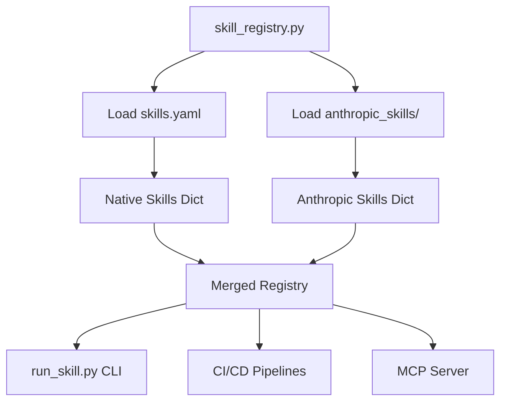

# InsightPulse AI - Agent Skills Documentation

## Overview

InsightPulse AI uses a hybrid skills system that combines:

1. **Native Python-based skills** - Custom OCA compliance validators with RAG enhancement
2. **Anthropic prompt-based skills** - External skills from [anthropics/skills](https://github.com/anthropics/skills)
3. **Skill profiles** - Pre-configured combinations for common scenarios

This system enables automated compliance validation, code quality checks, and integration with CI/CD pipelines.

## Table of Contents

- [Architecture](#architecture)
- [Native Skills](#native-skills)
- [Anthropic Skills](#anthropic-skills)
- [Skill Profiles](#skill-profiles)
- [Usage](#usage)
- [CI/CD Integration](#cicd-integration)
- [Docker Support](#docker-support)
- [MCP Integration](#mcp-integration)
- [Development](#development)

---

## Architecture

### Components

```
insightpulse-odoo/
├── agents/
│   ├── skill_registry.py       # Unified skill loader
│   ├── run_skill.py            # CLI executor
│   ├── skills.yaml             # Native skills registry
│   ├── Dockerfile.skills       # Docker image
│   └── docker-compose.skills.yml
├── anthropic_skills/           # Anthropic skills repo (git submodule)
│   ├── algorithmic-art/
│   ├── artifacts-builder/
│   └── ...
└── scripts/
    ├── import_anthropic_skills.py
    └── ci_run_skills.sh
```

### Skill Registry Flow



---

## Native Skills

Native skills are Python-based validators that check OCA compliance, code quality, and security.

### Available Native Skills

| Skill ID | Description | Tags |
|----------|-------------|------|
| `odoo.manifest.validate` | Validates `__manifest__.py` files for Odoo 18.0, LGPL-3, InsightPulseAI metadata | `odoo`, `oca`, `compliance`, `fast-check`, `manifest` |
| `odoo.directory.validate` | Validates single canonical `odoo_addons/` directory (OCA standard) | `odoo`, `oca`, `compliance`, `directory`, `structure` |
| `odoo.naming.validate` | Validates `ipai_*` prefix for custom modules | `odoo`, `oca`, `compliance`, `naming`, `ipai_prefix` |
| `odoo.readme.validate` | Validates README.rst files for OCA documentation standards | `odoo`, `oca`, `compliance`, `documentation`, `readme` |
| `visual_compliance.full_scan` | Runs all compliance validators and generates comprehensive report | `orchestrator`, `compliance`, `full-scan` |

### RAG-Enhanced Skills

These skills use a knowledge graph for context-aware validation:

| Skill ID | Description | Knowledge Sources |
|----------|-------------|-------------------|
| `odoo.manifest.validate_rag` | Manifest validation with OCA guideline vector search | OCA maintainer-tools, Odoo docs |
| `odoo.python.validate_rag` | Python code quality with OCA examples | OCA repositories, Python best practices |
| `odoo.xml.validate_rag` | XML/View validation with official Odoo patterns | Odoo 18.0 documentation |
| `odoo.security.validate_rag` | Security validation with best practices | Odoo security docs, OCA guidelines |

### Knowledge Graph Sources

The RAG system ingests documentation from:

- **OCA/OpenUpgrade** (18.0) - Migration patterns
- **OCA/oca-github-bot** - Automation guidelines
- **OCA/maintainer-tools** - THE LAW (compliance standards)
- **OCA/OCB** (18.0) - Community backports
- **OCA/odoo-community.org** - Contributing guidelines
- **odoo/odoo** (18.0) - Official source code
- **odoo/documentation** (18.0) - Official documentation

---

## Anthropic Skills

Anthropic skills are prompt-based skills from the official [anthropics/skills](https://github.com/anthropics/skills) repository.

### Available Anthropic Skills

| Skill ID | Description | License |
|----------|-------------|---------|
| `anthropic.algorithmic-art` | Create generative art using p5.js | Apache 2.0 |
| `anthropic.artifacts-builder` | Build complex claude.ai HTML artifacts (React, Tailwind, shadcn/ui) | Source-available |
| `anthropic.brand-guidelines` | Apply Anthropic brand colors and typography | Apache 2.0 |
| `anthropic.canvas-design` | Create visual art in PNG/PDF formats | Apache 2.0 |
| `anthropic.docx` | Create/edit Word documents | Source-available |
| `anthropic.internal-comms` | Write internal communications | Apache 2.0 |
| `anthropic.mcp-builder` | Guide for creating MCP servers | Apache 2.0 |
| `anthropic.pdf` | Comprehensive PDF manipulation | Source-available |
| `anthropic.pptx` | Create/edit PowerPoint presentations | Source-available |
| `anthropic.skill-creator` | Guide for creating effective skills | Apache 2.0 |
| `anthropic.slack-gif-creator` | Create animated GIFs for Slack | Apache 2.0 |

### Updating Anthropic Skills

```bash
cd anthropic_skills
git pull upstream main
```

---

## Skill Profiles

Profiles are pre-configured combinations of skills for common scenarios.

### Available Profiles

| Profile ID | Description | Skills |
|-----------|-------------|--------|
| `fast_check` | Quick manifest + directory validation for CI | `odoo.manifest.validate`, `odoo.directory.validate` |
| `full_compliance` | Complete validation suite | `odoo.manifest.validate`, `odoo.directory.validate`, `odoo.naming.validate`, `odoo.readme.validate` |
| `pr_review` | Validation for PR checks (no autofix) | `odoo.manifest.validate`, `odoo.directory.validate` |
| `weekly_audit` | Full scan with issue creation | `visual_compliance.full_scan` |
| `rag_full_compliance` | RAG-enhanced full compliance | All RAG validators + standard validators |
| `rag_security_audit` | Deep security validation | `odoo.security.validate_rag`, `odoo.manifest.validate_rag` |
| `rag_code_quality` | Python and XML validation with OCA examples | `odoo.python.validate_rag`, `odoo.xml.validate_rag` |
| `knowledge_graph_bootstrap` | Initialize knowledge graph | `knowledge_graph.ingest` |

---

## Usage

### CLI

#### List all skills
```bash
python3 -m agents.run_skill --list
```

#### List skills by tag
```bash
python3 -m agents.run_skill --list --tag rag
```

#### Run a single skill
```bash
python3 -m agents.run_skill odoo.manifest.validate --repo-path . --fix
```

#### Run a skill profile
```bash
python3 -m agents.run_skill --profile fast_check --repo-path .
```

#### Run with JSON output (for CI)
```bash
python3 -m agents.run_skill --profile full_compliance --repo-path . --json
```

### Python API

```python
from agents.skill_registry import get_skill, get_profiles, list_skills

# Get a skill
run_skill, metadata = get_skill("odoo.manifest.validate")
result = run_skill({"repo_path": ".", "fix": False})

# List skills by tag
rag_skills = list_skills(tag="rag")

# Get profile skills
from agents.skill_registry import get_profile_skills
skills = get_profile_skills("fast_check")
```

---

## CI/CD Integration

### GitHub Actions

Three pre-configured workflows are available:

#### 1. Fast Check (PR validation)
**Workflow:** `.github/workflows/skills-fast-check.yml`

- Runs on every PR to `main`, `develop`, `ipai-*`
- Profile: `fast_check`
- Posts results as PR comment
- Fails if violations detected

#### 2. Full Compliance (Weekly audit)
**Workflow:** `.github/workflows/skills-full-compliance.yml`

- Runs weekly (Sundays at 2 AM UTC)
- Profile: `full_compliance`
- Creates GitHub issues for violations (optional)
- Generates compliance report artifact

#### 3. RAG Compliance (Monthly deep scan)
**Workflow:** `.github/workflows/skills-rag-compliance.yml`

- Runs monthly (1st at 3 AM UTC)
- Profiles: `rag_full_compliance`, `rag_security_audit`, `rag_code_quality`
- Uses knowledge graph for enhanced validation
- Requires secrets: `VISUAL_KG_SUPABASE_URL`, `VISUAL_KG_SUPABASE_KEY`, `OPENAI_API_KEY`

### Using the CI Script

```bash
# Run fast check
SKILL_PROFILE=fast_check ./scripts/ci_run_skills.sh

# Run full compliance with JSON output
SKILL_PROFILE=full_compliance OUTPUT_FORMAT=json ./scripts/ci_run_skills.sh

# Run without failing on violations
FAIL_ON_VIOLATIONS=false ./scripts/ci_run_skills.sh
```

---

## Docker Support

### Build the skills runner image

```bash
docker build -f agents/Dockerfile.skills -t insightpulseai/skills-runner:latest .
```

### Run with Docker Compose

```bash
# List all skills
docker-compose -f agents/docker-compose.skills.yml up skills-runner

# Run fast check
docker-compose -f agents/docker-compose.skills.yml up skills-fast-check

# Run full compliance
docker-compose -f agents/docker-compose.skills.yml up skills-full-compliance

# Run RAG compliance (requires env vars)
export VISUAL_KG_SUPABASE_URL=your_url
export VISUAL_KG_SUPABASE_KEY=your_key
docker-compose -f agents/docker-compose.skills.yml up skills-rag-compliance
```

### Docker Compose Services

- `skills-runner` - Interactive CLI
- `skills-ci` - Base CI runner
- `skills-fast-check` - Fast check profile
- `skills-full-compliance` - Full compliance profile
- `skills-rag-compliance` - RAG-enhanced compliance

---

## MCP Integration

### MCP Server Configuration

Add to your MCP server's `claude_desktop_config.json`:

```json
{
  "mcpServers": {
    "insightpulse-skills": {
      "command": "python3",
      "args": ["-m", "agents.run_skill"],
      "cwd": "/path/to/insightpulse-odoo",
      "env": {
        "PYTHONPATH": "/path/to/insightpulse-odoo",
        "VISUAL_KG_SUPABASE_URL": "your_supabase_url",
        "VISUAL_KG_SUPABASE_KEY": "your_supabase_key"
      }
    }
  }
}
```

### Using Skills in MCP

```python
# Example MCP tool implementation
from agents.skill_registry import load_registry, get_skill

@server.tool()
async def run_compliance_check(profile: str = "fast_check"):
    """Run OCA compliance check"""
    run_skill, meta = get_skill(profile)
    result = run_skill({"repo_path": "."})
    return result
```

---

## Development

### Adding a New Native Skill

1. Create the validator module in `agents/visual-compliance/src/visual_compliance/validators/`
2. Implement the `run_skill(params: Dict) -> Dict` function
3. Add the skill to `agents/skills.yaml`:

```yaml
skills:
  - id: odoo.my_new_skill
    name: "My New Skill"
    description: "What this skill does and when to use it"
    module: "visual_compliance.validators.my_validator"
    entrypoint: "run_skill"
    tags: ["odoo", "oca", "compliance"]
    inputs:
      - name: "repo_path"
        type: "string"
        required: false
        default: "."
    outputs:
      - name: "ok"
        type: "boolean"
```

### Creating a Custom Profile

Add to `agents/skills.yaml`:

```yaml
profiles:
  - id: my_custom_profile
    name: "My Custom Profile"
    description: "What this profile does"
    skills:
      - odoo.manifest.validate
      - odoo.directory.validate
      - odoo.my_new_skill
    options:
      fix: true
```

### Testing

```bash
# Test skill registry loading
python3 agents/skill_registry.py

# Test a specific skill
python3 -m agents.run_skill odoo.manifest.validate --repo-path . --info

# Test import script
python3 scripts/import_anthropic_skills.py --export test_skills.yaml
```

---

## Troubleshooting

### ModuleNotFoundError: No module named 'visual_compliance'

The `visual_compliance` module needs to be in your PYTHONPATH:

```bash
export PYTHONPATH=/path/to/insightpulse-odoo:$PYTHONPATH
```

### Anthropic skills not loading

Ensure the anthropic_skills directory exists:

```bash
git clone https://github.com/anthropics/skills.git anthropic_skills
cd anthropic_skills && git remote rename origin upstream
```

### RAG skills failing

RAG skills require environment variables:

```bash
export VISUAL_KG_SUPABASE_URL=your_url
export VISUAL_KG_SUPABASE_KEY=your_key
export OPENAI_API_KEY=your_key
```

---

## References

- [OCA Contributing Guidelines](https://github.com/OCA/odoo-community.org/blob/master/website/Contribution/CONTRIBUTING.rst)
- [OCA Maintainer Tools](https://github.com/OCA/maintainer-tools)
- [Anthropic Skills Repository](https://github.com/anthropics/skills)
- [Agent Skills Spec](https://github.com/anthropics/skills/blob/main/agent_skills_spec.md)
- [Odoo 18.0 Documentation](https://www.odoo.com/documentation/18.0/)

---

**Last Updated:** 2025-11-11
**Version:** 1.0.0
**Maintained by:** InsightPulse AI Team
