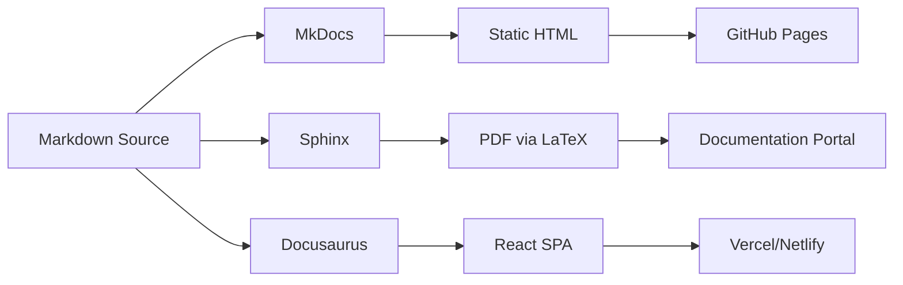
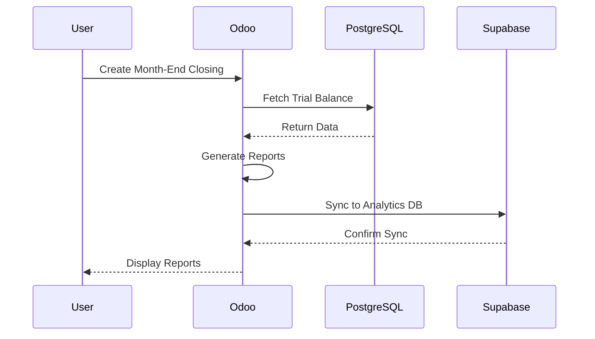
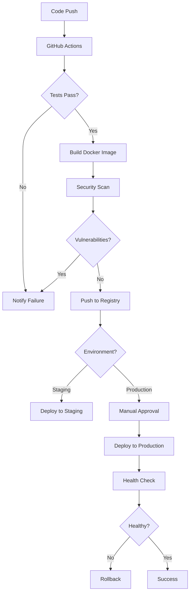

# Documentation Management & Publication System

## 📋 Table of Contents

- [Documentation Strategy](#documentation-strategy)
- [Documentation Types & Standards](#documentation-types--standards)
- [Publication Workflows](#publication-workflows)
- [Version Control for Docs](#version-control-for-docs)
- [Documentation as Code](#documentation-as-code)
- [Multi-Format Publishing](#multi-format-publishing)
- [Documentation Testing](#documentation-testing)
- [Search & Discovery](#search--discovery)
- [Localization & Translation](#localization--translation)
- [Automated Documentation](#automated-documentation)

---

## Documentation Strategy

### Documentation Hierarchy

```
┌─────────────────────────────────────────────────────────────────┐
│                    LEVEL 1: STRATEGIC                            │
│  Architecture Decisions Records (ADRs)                          │
│  System Architecture Diagrams                                   │
│  Technology Radar / Stack Documentation                         │
└────────────────────────┬────────────────────────────────────────┘
                         │
┌────────────────────────┴────────────────────────────────────────┐
│                    LEVEL 2: OPERATIONAL                          │
│  API Documentation (OpenAPI/Swagger)                            │
│  Deployment Guides                                              │
│  Runbooks & SOPs                                                │
│  CI/CD Workflow Documentation                                   │
└────────────────────────┬────────────────────────────────────────┘
                         │
┌────────────────────────┴────────────────────────────────────────┐
│                    LEVEL 3: TACTICAL                             │
│  Module Documentation                                           │
│  Code Comments & Docstrings                                     │
│  README files                                                   │
│  How-to Guides                                                  │
└────────────────────────┬────────────────────────────────────────┘
                         │
┌────────────────────────┴────────────────────────────────────────┐
│                    LEVEL 4: REFERENCE                            │
│  Inline code documentation                                      │
│  Configuration reference                                        │
│  CLI reference                                                  │
│  Troubleshooting guides                                         │
└─────────────────────────────────────────────────────────────────┘
```

### Documentation Locations by Type

| Type | Location | Format | Auto-Generated | Version Control |
|------|----------|--------|----------------|-----------------|
| **Architecture** | `docs/architecture/` | Markdown + Diagrams | ❌ | ✅ Git |
| **API Reference** | `docs/api/` | OpenAPI YAML | ✅ Auto | ✅ Git |
| **User Guides** | `docs/guides/` | Markdown | ❌ | ✅ Git |
| **Module Docs** | `addons/*/README.md` | Markdown | ❌ | ✅ Git |
| **Code Docs** | Docstrings in `.py` | reStructuredText | ✅ Sphinx | ✅ Git |
| **Runbooks** | `docs/runbooks/` | Markdown | ❌ | ✅ Git |
| **ADRs** | `docs/adr/` | Markdown | ❌ Template | ✅ Git |
| **Changelog** | `CHANGELOG.md` | Markdown | ✅ Auto | ✅ Git |
| **Release Notes** | `docs/releases/` | Markdown | ✅ Auto | ✅ Git |

---

## Documentation Types & Standards

### Architecture Decision Records (ADRs)

**Template**: `docs/adr/NNNN-title.md`

```markdown
# ADR-0001: Use PostgreSQL as Primary Database

## Status
Accepted

## Context
We need a reliable, ACID-compliant database for the Odoo ERP system...

## Decision
We will use PostgreSQL 16 as our primary database.

## Consequences

### Positive
- Native JSON support for flexible schemas
- Excellent performance for complex queries
- Strong community support
- Compatible with Odoo requirements

### Negative
- Requires PostgreSQL expertise
- More complex than SQLite for development
- Needs proper backup strategy

## Alternatives Considered
- MySQL: Less feature-rich for our use case
- MongoDB: Not ACID compliant
- SQLite: Not suitable for production

## References
- [PostgreSQL Documentation](https://www.postgresql.org/docs/)
- [Odoo Database Requirements](https://www.odoo.com/documentation/19.0/administration/install.html)

## Date
2025-11-10

## Author
DevOps Team
```

**Creating ADRs Workflow**

```bash
#!/bin/bash
# scripts/new-adr.sh

# Get next ADR number
ADR_DIR="docs/adr"
LAST_ADR=$(ls $ADR_DIR | grep -E '^[0-9]{4}' | sort -n | tail -1 | cut -d'-' -f1)
NEXT_NUM=$(printf "%04d" $((10#$LAST_ADR + 1)))

# Get title from user
read -p "ADR Title: " TITLE
SLUG=$(echo "$TITLE" | tr '[:upper:]' '[:lower:]' | tr ' ' '-')

# Create from template
cp $ADR_DIR/template.md "$ADR_DIR/$NEXT_NUM-$SLUG.md"

# Replace placeholders
sed -i "s/{{NUMBER}}/$NEXT_NUM/g" "$ADR_DIR/$NEXT_NUM-$SLUG.md"
sed -i "s/{{TITLE}}/$TITLE/g" "$ADR_DIR/$NEXT_NUM-$SLUG.md"
sed -i "s/{{DATE}}/$(date +%Y-%m-%d)/g" "$ADR_DIR/$NEXT_NUM-$SLUG.md"
sed -i "s/{{AUTHOR}}/$USER/g" "$ADR_DIR/$NEXT_NUM-$SLUG.md"

echo "Created: $ADR_DIR/$NEXT_NUM-$SLUG.md"
```

### API Documentation (OpenAPI)

**Location**: `docs/api/openapi.yaml`

```yaml
openapi: 3.0.0
info:
  title: InsightPulse Odoo API
  version: 19.0.0
  description: REST API for InsightPulse Odoo ERP
  contact:
    name: API Support
    email: api@insightpulseai.net

servers:
  - url: https://insightpulseai.net/api/v1
    description: Production
  - url: https://staging.insightpulseai.net/api/v1
    description: Staging

paths:
  /finance/agencies:
    get:
      summary: List all agencies
      tags:
        - Finance
      parameters:
        - name: active
          in: query
          schema:
            type: boolean
          description: Filter by active status
      responses:
        '200':
          description: Success
          content:
            application/json:
              schema:
                type: array
                items:
                  $ref: '#/components/schemas/Agency'

components:
  schemas:
    Agency:
      type: object
      required:
        - code
        - name
      properties:
        code:
          type: string
          example: "RIM"
        name:
          type: string
          example: "Research Institute for Mindanao"
        tin:
          type: string
          example: "123-456-789-000"
```

**Auto-generating from Code**

```python
# addons/custom/api_docs/__init__.py
from odoo import http
from odoo.http import request
import json

class APIDocController(http.Controller):

    @http.route('/api/docs/openapi.json', auth='public', type='http')
    def openapi_spec(self):
        """Auto-generate OpenAPI spec from route decorators"""
        spec = {
            "openapi": "3.0.0",
            "info": {
                "title": "InsightPulse Odoo API",
                "version": "19.0.0"
            },
            "paths": {}
        }

        # Scan all HTTP routes
        for rule in http.routing_map().iter_rules():
            if rule.endpoint.startswith('api.'):
                # Extract route info
                spec["paths"][rule.rule] = self._extract_path_spec(rule)

        return request.make_response(
            json.dumps(spec, indent=2),
            headers={'Content-Type': 'application/json'}
        )
```

### Module Documentation

**Template**: `addons/custom/{module}/README.md`

```markdown
# Module: IPAI Finance SSC

## Overview
Multi-agency finance shared service center for non-profit organizations.

## Features
- Multi-agency accounting
- Month-end closing automation
- BIR tax form generation (1601-C, 2550Q, 1702-RT)
- Bank reconciliation (80% auto-match)
- Multi-agency consolidation

## Installation

### Requirements
- Odoo 19.0 CE
- Python 3.11+
- PostgreSQL 16+

### Dependencies
```python
'depends': ['account', 'account_reports', 'base', 'web']
```

### Installation Steps
```bash
# 1. Copy module to addons directory
cp -r ipai_finance_ssc /path/to/odoo/addons/custom/

# 2. Update apps list
odoo -d odoo -u all --stop-after-init

# 3. Install module
odoo -d odoo -i ipai_finance_ssc --stop-after-init
```

## Configuration

### 1. Setup Agencies
Navigate to **Finance SSC → Configuration → Agencies**

Add your agencies:
- Code: RIM
- Name: Research Institute for Mindanao
- TIN: 123-456-789-000
- RDO: 116

### 2. Configure Integrations

**Supabase**:
```python
# System Parameters
supabase_url = https://xyz.supabase.co
supabase_key = your_api_key
```

**Notion**:
```python
notion_token = secret_token
notion_database_id = database_id
```

## Usage

### Month-End Closing
1. Navigate to **Finance SSC → Operations → Month-End Closing**
2. Click **Create**
3. Select agency and period
4. Click **Generate Reports**
5. Review trial balance and variance report
6. Click **Finalize & Lock Period**

### BIR Form Filing
1. Navigate to **Finance SSC → BIR Forms**
2. Click **Create** or use auto-generated forms
3. Review form data
4. Click **Generate PDF**
5. E-file with BIR
6. Mark as **Filed** and **Paid**

## API Reference

### REST API

```python
# Get agencies
GET /api/v1/finance/agencies

# Create month-end closing
POST /api/v1/finance/month-end-closings
{
  "agency_id": 1,
  "period": "2025-10-01"
}
```

### XML-RPC

```python
import xmlrpc.client

url = 'https://insightpulseai.net'
db = 'odoo'
username = 'admin'
password = 'password'

common = xmlrpc.client.ServerProxy(f'{url}/xmlrpc/2/common')
uid = common.authenticate(db, username, password, {})

models = xmlrpc.client.ServerProxy(f'{url}/xmlrpc/2/object')
agencies = models.execute_kw(db, uid, password,
    'finance.ssc.agency', 'search_read',
    [[['active', '=', True]]],
    {'fields': ['code', 'name', 'tin']}
)
```

## Troubleshooting

### Issue: Month-end closing fails with "Unbalanced trial balance"

**Cause**: Debit and credit totals don't match

**Solution**:
1. Check for unposted journal entries
2. Review draft invoices
3. Verify exchange rate differences
4. Run balance check: **Accounting → Reporting → Trial Balance**

### Issue: BIR form shows incorrect amounts

**Cause**: Missing tax mappings

**Solution**:
1. Check tax configuration: **Accounting → Configuration → Taxes**
2. Map taxes to BIR form fields
3. Regenerate form

## Development

### Running Tests
```bash
odoo -d test_db -i ipai_finance_ssc --test-enable --stop-after-init
```

### Code Style
- Follow PEP 8
- Use Black for formatting
- Run Pylint before committing

## Support
- **Issues**: https://github.com/jgtolentino/insightpulse-odoo/issues
- **Email**: support@insightpulseai.net
- **Docs**: https://docs.insightpulseai.net

## License
AGPL-3.0

## Changelog
See [CHANGELOG.md](CHANGELOG.md)
```

---

## Publication Workflows

### Multi-Platform Publishing



### GitHub Pages Publication

**Workflow**: `.github/workflows/publish-docs.yml`

```yaml
name: Publish Documentation

on:
  push:
    branches: [main]
    paths:
      - 'docs/**'
      - 'mkdocs.yml'
  workflow_dispatch:

jobs:
  publish:
    name: 📚 Publish Documentation
    runs-on: ubuntu-latest

    steps:
      - name: 📥 Checkout code
        uses: actions/checkout@v4
        with:
          fetch-depth: 0  # Full history for git dates

      - name: 🐍 Setup Python
        uses: actions/setup-python@v5
        with:
          python-version: '3.11'

      - name: 📦 Install MkDocs and plugins
        run: |
          pip install mkdocs-material
          pip install mkdocs-mermaid2-plugin
          pip install mkdocs-git-revision-date-localized-plugin
          pip install mkdocs-minify-plugin
          pip install mkdocs-redirects

      - name: 🏗️ Build documentation
        run: mkdocs build --strict

      - name: 📊 Generate API docs
        run: |
          pip install sphinx sphinx-rtd-theme
          cd docs/api
          sphinx-apidoc -o source/ ../../addons/custom
          make html

      - name: 📤 Deploy to GitHub Pages
        uses: peaceiris/actions-gh-pages@v3
        with:
          github_token: ${{ secrets.GITHUB_TOKEN }}
          publish_dir: ./site
          cname: docs.insightpulseai.net
          commit_message: 'docs: update documentation'

      - name: 📢 Notify Slack
        uses: slackapi/slack-github-action@v1
        with:
          payload: |
            {
              "text": "📚 Documentation published to https://docs.insightpulseai.net"
            }
        env:
          SLACK_WEBHOOK_URL: ${{ secrets.SLACK_WEBHOOK_URL }}
```

### MkDocs Configuration

**File**: `mkdocs.yml`

```yaml
site_name: InsightPulse Odoo Documentation
site_url: https://docs.insightpulseai.net
repo_url: https://github.com/jgtolentino/insightpulse-odoo
repo_name: jgtolentino/insightpulse-odoo

theme:
  name: material
  palette:
    - scheme: default
      primary: indigo
      accent: indigo
      toggle:
        icon: material/brightness-7
        name: Switch to dark mode
    - scheme: slate
      primary: indigo
      accent: indigo
      toggle:
        icon: material/brightness-4
        name: Switch to light mode
  features:
    - navigation.tabs
    - navigation.sections
    - navigation.expand
    - navigation.top
    - search.suggest
    - search.highlight
    - content.code.copy

plugins:
  - search
  - git-revision-date-localized:
      enable_creation_date: true
  - mermaid2
  - minify:
      minify_html: true
  - redirects:
      redirect_maps:
        'old-page.md': 'new-page.md'

markdown_extensions:
  - admonition
  - pymdownx.details
  - pymdownx.superfences:
      custom_fences:
        - name: mermaid
          class: mermaid
          format: !!python/name:pymdownx.superfences.fence_code_format
  - pymdownx.tabbed:
      alternate_style: true
  - pymdownx.emoji:
      emoji_index: !!python/name:materialx.emoji.twemoji
      emoji_generator: !!python/name:materialx.emoji.to_svg
  - tables
  - footnotes
  - attr_list
  - md_in_html

nav:
  - Home: index.md
  - Getting Started:
    - Installation: getting-started/installation.md
    - Quick Start: getting-started/quickstart.md
    - Configuration: getting-started/configuration.md
  - Architecture:
    - Overview: architecture/overview.md
    - System Architecture: ARCHITECTURE.md
    - Infrastructure Index: INFRASTRUCTURE_INDEX.md
  - Modules:
    - Finance SSC: modules/ipai-finance-ssc.md
    - Expense: modules/ipai-expense.md
    - Procurement: modules/ipai-procure.md
  - CI/CD:
    - Overview: cicd/overview.md
    - Workflows: cicd/workflows.md
    - Git Operations: GIT_ADVANCED_OPERATIONS.md
  - API Reference:
    - REST API: api/rest.md
    - XML-RPC: api/xmlrpc.md
  - Deployment:
    - Docker: deployment/docker.md
    - Kubernetes: deployment/kubernetes.md
    - Database Migration: deployment/migration.md
  - Troubleshooting:
    - Common Issues: troubleshooting/common-issues.md
    - Performance: troubleshooting/performance.md

extra:
  social:
    - icon: fontawesome/brands/github
      link: https://github.com/jgtolentino/insightpulse-odoo
    - icon: fontawesome/brands/slack
      link: https://insightpulse.slack.com
  version:
    provider: mike
    default: stable
```

### Versioned Documentation (Mike)

```bash
# Install mike
pip install mike

# Deploy version 19.0
mike deploy --push --update-aliases 19.0 stable

# Deploy version 18.0
mike deploy --push 18.0

# Set default version
mike set-default --push stable

# List versions
mike list

# Delete version
mike delete --push 18.0
```

---

## Documentation as Code

### Diagram as Code (Mermaid)

**Embedded in Markdown**:

````markdown

````

**Standalone File**: `docs/diagrams/deployment-flow.mmd`



### Auto-generated Class Diagrams

**Using pyreverse (Pylint)**:

```bash
# Generate class diagram for a module
pyreverse -o png -p ipai_finance_ssc addons/custom/ipai_finance_ssc/models/

# Output: classes_ipai_finance_ssc.png, packages_ipai_finance_ssc.png

# Move to docs
mv classes_*.png docs/diagrams/
mv packages_*.png docs/diagrams/
```

### Auto-generated API Documentation

**Using Sphinx autodoc**:

```python
# conf.py
extensions = [
    'sphinx.ext.autodoc',
    'sphinx.ext.napoleon',  # Google/NumPy docstring support
    'sphinx.ext.viewcode',
    'sphinx.ext.intersphinx',
]

# Napoleon settings for Google-style docstrings
napoleon_google_docstring = True
napoleon_numpy_docstring = False

# Autodoc settings
autodoc_default_options = {
    'members': True,
    'member-order': 'bysource',
    'special-members': '__init__',
    'undoc-members': True,
    'exclude-members': '__weakref__'
}
```

**Module docstring example**:

```python
"""
Finance SSC Agency Module
==========================

This module manages multi-agency accounting for non-profit organizations.

Classes:
    FinanceSscAgency: Main agency model

Examples:
    Create a new agency:

    >>> agency = env['finance.ssc.agency'].create({
    ...     'code': 'RIM',
    ...     'name': 'Research Institute for Mindanao',
    ...     'tin': '123-456-789-000'
    ... })

    Sync to Supabase:

    >>> agency.action_sync_to_supabase()

Attributes:
    DEFAULT_RDO (str): Default RDO code for Philippines
    AUTO_SYNC_INTERVAL (int): Minutes between auto-sync operations
"""

from odoo import models, fields, api

class FinanceSscAgency(models.Model):
    """
    Agency model for multi-organizational accounting.

    This model represents a legal entity (non-profit organization, foundation)
    with its own tax identification and accounting requirements.

    Attributes:
        code (str): Unique agency code (e.g., 'RIM', 'CKVC')
        name (str): Full legal name of the agency
        tin (str): Tax Identification Number (format: XXX-XXX-XXX-XXX)
        rdo_code (str): Revenue District Office code
        contact_person (str): Primary contact person name
        supabase_synced (bool): Whether agency is synced to Supabase
        notion_synced (bool): Whether agency is synced to Notion

    Methods:
        action_sync_to_supabase: Sync agency data to Supabase analytics DB
        action_sync_to_notion: Sync agency to Notion knowledge base
        _compute_statistics: Compute financial statistics for smart buttons
    """

    _name = 'finance.ssc.agency'
    _description = 'Finance SSC Agency'

    code = fields.Char(
        string='Agency Code',
        required=True,
        help="Unique identifier for the agency (e.g., RIM, CKVC)"
    )

    def action_sync_to_supabase(self):
        """
        Sync agency data to Supabase analytics database.

        This method pushes agency information to an external Supabase database
        for real-time analytics and reporting.

        Returns:
            dict: Action result with success/error message

        Raises:
            UserError: If Supabase configuration is missing
            ValidationError: If agency data is invalid

        Example:
            >>> agency = env['finance.ssc.agency'].browse(1)
            >>> result = agency.action_sync_to_supabase()
            >>> print(result['message'])
            'Successfully synced to Supabase'
        """
        pass
```

---

## Documentation Testing

### Link Checking

**GitHub Action**: `.github/workflows/docs-link-check.yml`

```yaml
name: Documentation Link Check

on:
  schedule:
    - cron: '0 0 * * 0'  # Weekly on Sunday
  workflow_dispatch:

jobs:
  link-check:
    runs-on: ubuntu-latest
    steps:
      - uses: actions/checkout@v4

      - name: 🔍 Check links
        uses: lycheeverse/lychee-action@v1
        with:
          args: --verbose --no-progress 'docs/**/*.md' '**/*.md'
          fail: true
        env:
          GITHUB_TOKEN: ${{ secrets.GITHUB_TOKEN }}

      - name: 📊 Create issue if broken links found
        if: failure()
        uses: actions/github-script@v7
        with:
          script: |
            github.rest.issues.create({
              owner: context.repo.owner,
              repo: context.repo.repo,
              title: '🔗 Broken links found in documentation',
              body: 'Automated link check found broken links. See workflow run for details.',
              labels: ['documentation', 'bug']
            })
```

### Markdown Linting

```bash
# Install markdownlint-cli
npm install -g markdownlint-cli

# Create config: .markdownlint.json
{
  "default": true,
  "MD013": { "line_length": 120 },
  "MD033": false,  # Allow inline HTML
  "MD041": false   # Allow first line not to be H1
}

# Lint all markdown
markdownlint '**/*.md' --ignore node_modules

# Auto-fix
markdownlint '**/*.md' --fix
```

### Spell Checking

```bash
# Install cspell
npm install -g cspell

# Create config: cspell.json
{
  "version": "0.2",
  "language": "en",
  "words": [
    "odoo",
    "postgresql",
    "supabase",
    "mkdocs",
    "ipai"
  ],
  "ignoreRegExpList": [
    "/```[\\s\\S]*?```/g",  # Code blocks
    "/`[^`]*`/g"             # Inline code
  ],
  "ignorePaths": [
    "node_modules/**",
    "**/*.lock",
    "dist/**"
  ]
}

# Check spelling
cspell "docs/**/*.md"
```

---

## Search & Discovery

### Algolia DocSearch

**Configuration**: `.algolia/config.json`

```json
{
  "index_name": "insightpulse_odoo",
  "start_urls": ["https://docs.insightpulseai.net"],
  "selectors": {
    "lvl0": {
      "selector": ".md-nav__item--active > .md-nav__link",
      "global": true,
      "default_value": "Documentation"
    },
    "lvl1": "article h1",
    "lvl2": "article h2",
    "lvl3": "article h3",
    "lvl4": "article h4",
    "text": "article p, article li"
  },
  "scrape_start_urls": false,
  "strip_chars": " .,;:#"
}
```

**MkDocs Integration**:

```yaml
# mkdocs.yml
extra:
  search:
    language: en
  algolia:
    appId: YOUR_APP_ID
    apiKey: YOUR_SEARCH_KEY
    indexName: insightpulse_odoo
```

---

## Localization & Translation

### Multi-language Support

**Directory Structure**:
```
docs/
├── en/
│   ├── index.md
│   ├── guides/
│   └── api/
├── es/
│   ├── index.md
│   ├── guides/
│   └── api/
└── fr/
    ├── index.md
    ├── guides/
    └── api/
```

**MkDocs i18n Plugin**:

```yaml
# mkdocs.yml
plugins:
  - i18n:
      default_language: en
      languages:
        en: English
        es: Español
        fr: Français
      nav_translations:
        es:
          Home: Inicio
          Getting Started: Primeros Pasos
        fr:
          Home: Accueil
          Getting Started: Démarrage
```

### Translation Workflow

```bash
# Extract translatable strings
pybabel extract -F babel.cfg -o messages.pot docs/

# Create translation file
pybabel init -i messages.pot -d docs/locales -l es

# Translate docs/locales/es/LC_MESSAGES/messages.po
# Then compile:
pybabel compile -d docs/locales

# Update translations
pybabel update -i messages.pot -d docs/locales
```

---

## Automated Documentation

### Auto-generate CHANGELOG

**Using conventional commits**:

```bash
# Install standard-version
npm install -g standard-version

# Generate changelog from commits
standard-version

# Preview
standard-version --dry-run

# Custom template: .versionrc.json
{
  "types": [
    {"type": "feat", "section": "Features"},
    {"type": "fix", "section": "Bug Fixes"},
    {"type": "docs", "section": "Documentation"},
    {"type": "perf", "section": "Performance"},
    {"type": "refactor", "section": "Code Refactoring"}
  ]
}
```

### Auto-generate Module Documentation

**Script**: `scripts/generate-module-docs.py`

```python
#!/usr/bin/env python3
import os
import ast
from pathlib import Path

def extract_manifest(module_path):
    """Extract information from __manifest__.py"""
    manifest_file = module_path / '__manifest__.py'
    with open(manifest_file, 'r') as f:
        manifest = ast.literal_eval(f.read())
    return manifest

def count_files(module_path):
    """Count Python and XML files"""
    py_files = len(list(module_path.rglob('*.py')))
    xml_files = len(list(module_path.rglob('*.xml')))
    return py_files, xml_files

def generate_module_doc(module_path):
    """Generate markdown documentation for a module"""
    manifest = extract_manifest(module_path)
    py_count, xml_count = count_files(module_path)

    doc = f"""# {manifest['name']}

**Version**: {manifest['version']}
**Category**: {manifest.get('category', 'Uncategorized')}
**Author**: {manifest.get('author', 'Unknown')}
**License**: {manifest.get('license', 'AGPL-3')}

## Description

{manifest.get('summary', manifest.get('description', 'No description provided'))}

## Dependencies

```python
{manifest.get('depends', [])}
```

## Statistics

- Python files: {py_count}
- XML files: {xml_count}
- Total files: {py_count + xml_count}

## Installation

```bash
odoo -d odoo -i {module_path.name} --stop-after-init
```

## Configuration

{manifest.get('configuration', 'No special configuration required')}

## Website

{manifest.get('website', 'N/A')}
"""

    return doc

# Generate docs for all modules
modules_dir = Path('addons/custom')
docs_dir = Path('docs/modules')
docs_dir.mkdir(exist_ok=True)

for module_path in modules_dir.iterdir():
    if module_path.is_dir() and (module_path / '__manifest__.py').exists():
        doc = generate_module_doc(module_path)
        doc_file = docs_dir / f"{module_path.name}.md"
        with open(doc_file, 'w') as f:
            f.write(doc)
        print(f"Generated: {doc_file}")
```

---

## Best Practices

### Documentation Principles

1. **DRY (Don't Repeat Yourself)**
   - Single source of truth
   - Use includes/references instead of duplication

2. **KISS (Keep It Simple, Stupid)**
   - Write for your audience
   - Avoid jargon
   - Use examples

3. **Documentation as Code**
   - Version controlled
   - Peer reviewed
   - Automated testing
   - CI/CD integration

4. **Living Documentation**
   - Auto-generated where possible
   - Updated with code changes
   - Regular reviews

### Writing Style Guide

```markdown
# Good Documentation Example

## Clear Title with Action Verb

### Problem Statement
Describe what problem this solves.

### Prerequisites
- Requirement 1
- Requirement 2

### Step-by-Step Instructions

1. **First step**: Do this
   ```bash
   command example
   ```

2. **Second step**: Do that
   ```bash
   another command
   ```

### Expected Result
What you should see after following the steps.

### Troubleshooting
- **Issue**: Error message
  **Solution**: How to fix

### Next Steps
- Link to related guide
- Link to advanced topics
```

---

**Last Updated**: 2025-11-10
**Maintained by**: InsightPulseAI Documentation Team
**License**: AGPL-3.0
