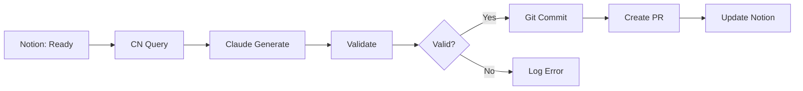

# Notion → Odoo Module Automation

**Complete guide to automating Odoo module generation from Notion feature requests using Continue CLI + MCP**

---

## 📋 Table of Contents

1. [Overview](#overview)
2. [Architecture](#architecture)
3. [Setup Guide](#setup-guide)
4. [Usage](#usage)
5. [Integration with SuperClaude Designer](#superclaude-designer)
6. [Workflows](#workflows)
7. [Troubleshooting](#troubleshooting)
8. [FAQ](#faq)

---

## Overview

This automation enables you to:
- ✅ Query Notion for feature requests marked "Ready for Development"
- ✅ Generate complete OCA-compliant Odoo 19 modules automatically
- ✅ Create models, views, security rules, tests, and documentation
- ✅ Update Notion cards with development status
- ✅ Commit and create PRs via GitHub Actions

### Time Savings
- **Manual development**: 2 weeks per feature
- **With automation**: 2 days per feature (including review)
- **Improvement**: 7x faster

---

## Architecture

```
┌─────────────┐
│   Notion    │  Feature Requests Database
│  Database   │  (Status: Ready for Development)
└──────┬──────┘
       │
       │ MCP Protocol
       ↓
┌─────────────┐
│ Continue CLI│  Headless automation engine
│   + MCP     │  Queries Notion, calls Claude
└──────┬──────┘
       │
       │ Prompts + Context
       ↓
┌─────────────┐
│   Claude    │  Code generation with
│  Sonnet 4.5 │  OCA guidelines + best practices
└──────┬──────┘
       │
       │ Generated Code
       ↓
┌─────────────┐
│    Odoo     │  Complete module structure
│   Module    │  Models, views, security, tests
└──────┬──────┘
       │
       │ Git commit
       ↓
┌─────────────┐
│   GitHub    │  PR created automatically
│  Actions    │  CI/CD validation
└─────────────┘
```

---

## Setup Guide

### Step 1: Install Continue CLI (5 minutes)

```bash
# Install globally
npm i -g @continuedev/cli

# Verify installation
cn --version
# Should output: continue-cli v0.x.x
```

### Step 2: Configure Notion Integration (10 minutes)

1. **Create Notion Integration**
   - Go to https://www.notion.so/my-integrations
   - Click "New integration"
   - Name: "Odoo Module Automation"
   - Associated workspace: Your workspace
   - Copy the "Internal Integration Token"

2. **Share Database with Integration**
   - Open your Feature Requests database in Notion
   - Click "..." → "Add connections"
   - Select your integration

3. **Get Database ID**
   - Open your database in Notion
   - Copy the URL: `https://notion.so/workspace/DATABASE_ID?v=...`
   - Extract `DATABASE_ID` (32-character alphanumeric)

### Step 3: Configure Continue CLI (5 minutes)

```bash
# Create config directory
mkdir -p ~/.continue/prompts

# Copy example config
cp .continue/config.example.json ~/.continue/config.json

# Edit config with your API keys
# Add:
# - NOTION_API_KEY (from Step 2)
# - ANTHROPIC_API_KEY (from https://console.anthropic.com)
```

**Example config:**
```json
{
  "mcpServers": {
    "notion": {
      "command": "npx",
      "args": ["-y", "@modelcontextprotocol/server-notion"],
      "env": {
        "NOTION_API_KEY": "secret_ABC123..."
      }
    }
  },
  "models": [{
    "title": "Claude Sonnet 4.5",
    "provider": "anthropic",
    "model": "claude-sonnet-4-20250514",
    "apiKey": "sk-ant-api03-ABC123..."
  }]
}
```

### Step 4: Copy Prompts (2 minutes)

```bash
# Copy prompts to Continue config
cp -r .continue/prompts/* ~/.continue/prompts/

# Verify
ls ~/.continue/prompts/
# Should show:
# odoo-developer.md
# travel-expense-generator.md
# finance-ssc-generator.md
```

### Step 5: Test Connection (3 minutes)

```bash
# Test Notion MCP connection
cn "List all databases I have access to in Notion"

# Should output your Notion databases
```

### Step 6: Configure GitHub Secrets (5 minutes)

In your GitHub repository:

1. Go to **Settings** → **Secrets and variables** → **Actions**
2. Add these secrets:
   - `NOTION_API_KEY` - Your Notion integration token
   - `ANTHROPIC_API_KEY` - Your Anthropic API key
   - `SUPABASE_URL` - (optional) Your Supabase project URL
   - `SUPABASE_SERVICE_ROLE_KEY` - (optional) For document storage

---

## Usage

### Manual Mode (Local Development)

#### Generate Single Module

```bash
# Process a specific Notion card
./scripts/notion-to-odoo.sh --single YOUR_NOTION_CARD_ID

# Example
./scripts/notion-to-odoo.sh --single abc123def456
```

#### Batch Process All Ready Features

```bash
# Process all cards marked "Ready for Development"
./scripts/notion-to-odoo.sh --batch
```

#### Dry Run (Preview Only)

```bash
# See what would be done without executing
./scripts/notion-to-odoo.sh --batch --dry-run
```

### Automated Mode (GitHub Actions)

The automation runs automatically:
- **Schedule**: Every weekday at 9 AM UTC (5 PM Manila time)
- **Manual**: Trigger via GitHub Actions UI

#### Manual Trigger

1. Go to **Actions** tab in GitHub
2. Select "Notion to Odoo Module Automation"
3. Click "Run workflow"
4. Choose options:
   - **Mode**: batch or dry-run
   - **Notion ID**: (optional) for single card

#### Review Generated PR

1. Check **Pull Requests** tab
2. Look for PR titled: "🤖 New Odoo Modules from Notion Feature Requests"
3. Review changes:
   - Module structure
   - Code quality
   - Security rules
   - Tests
   - Documentation

4. Test locally:
```bash
git fetch origin automation/notion-modules-*
git checkout automation/notion-modules-*
docker-compose up -d
odoo-bin -d test_db --init=new_module_name
```

5. Merge when ready

---

## Integration with SuperClaude Designer

### What is SuperClaude Designer?

**superclaude-designer** is a separate repository containing:
- 📚 **Comprehensive guides** (Continue CLI, SuperClaude Framework, integration patterns)
- 🤖 **Custom agents** (Finance SSC, BIR compliance, multi-agency orchestration)
- 📝 **Templates** (Module scaffolds, BIR forms, dashboards)
- 🔧 **Reusable scripts** (Automation workflows, validation tools)

### Why NOT a Submodule?

We chose **NOT** to add superclaude-designer as a git submodule because:

1. **Simplicity** - No submodule complexity for team members
2. **Flexibility** - Can customize patterns freely for this project
3. **Reusability** - Other projects can reference it independently
4. **Focus** - insightpulse-odoo stays focused on Odoo modules

### How to Use SuperClaude Designer Patterns

#### Option 1: Reference Documentation

The superclaude-designer repository contains comprehensive guides:
- `CONTINUE_CLI_AUTOMATION.md` - Continue CLI patterns
- `SUPERCLAUDE_CONTINUE_INTEGRATION.md` - Hybrid workflows
- `superclaude-odoo-agent.md` - Custom agent for Finance SSC
- `DECISION_FLOWCHART.md` - Which tool to use when

**Usage:**
```bash
# Clone for reference (outside this project)
cd ~/reference
git clone https://github.com/jgtolentino/superclaude-designer.git

# Read guides
less superclaude-designer/docs/CONTINUE_CLI_AUTOMATION.md
```

#### Option 2: Copy Specific Files

For patterns you'll customize heavily:

```bash
# Copy agent definitions
cp ~/reference/superclaude-designer/agents/odoo-finance-ssc.md \
   ~/.continue/prompts/

# Copy scripts
cp ~/reference/superclaude-designer/scripts/hybrid-workflow.sh \
   ./scripts/
```

#### Option 3: Use as npm Package (if published)

If superclaude-designer gets published as an npm package:

```bash
npm install -g @jgtolentino/superclaude-designer

# Use commands
scd generate-module --from-notion abc123
scd deploy --environment production
```

### When to Use Continue CLI vs SuperClaude

Based on superclaude-designer patterns:

| Task Type | Tool | Why |
|-----------|------|-----|
| Query Notion | Continue CLI | Fast, cheap ($0.003) |
| Simple module | Continue CLI | Single agent sufficient |
| Complex system | SuperClaude | Multi-agent orchestration |
| Parallel processing | SuperClaude | 8 agencies simultaneously |
| Quick prototype | Continue CLI | Faster iteration |
| Production quality | SuperClaude | Multi-agent review |

**Example: Month-End Closing**
```bash
# ❌ Slow: Continue CLI serial processing (2 hours)
for agency in RIM CKVC BOM JPAL JLI JAP LAS RMQB; do
    cn "Process month-end for $agency"
done

# ✅ Fast: SuperClaude parallel (16 minutes)
/sc:month-end --agencies=all --parallel --threads=8
```

---

## Workflows

### Workflow 1: Feature Request → Module



**Steps:**
1. PM marks Notion card "Ready for Development"
2. GitHub Action triggers (schedule or manual)
3. Continue CLI queries Notion via MCP
4. Claude generates module using odoo-developer.md prompt
5. Validation checks (syntax, OCA compliance)
6. Git commit + PR creation
7. Notion card updated to "In Development"

### Workflow 2: Travel Expense Module

For specialized modules like Travel Expense Management:

```bash
# Use specialized prompt
cn -p "travel-expense-generator" << 'EOF'
Generate the complete Travel Expense Management module as described
in the prompt. Include SAP Concur alternative features, BIR compliance,
and OCR integration.

Save to: ./addons/ipai_travel_expense/
EOF
```

### Workflow 3: Finance SSC (8 Agencies)

For complex multi-agency automation:

```bash
# Use finance-ssc-generator prompt
cn -p "finance-ssc-generator" << 'EOF'
Generate the complete Finance Shared Service Center module
supporting all 8 agencies (RIM, CKVC, BOM, JPAL, JLI, JAP, LAS, RMQB).

Include:
- Month-end closing workflows
- BIR compliance (1601-C, 1702-RT, 2550Q)
- Inter-company eliminations
- Consolidated reporting

Save to: ./addons/ipai_finance_ssc/
EOF
```

### Workflow 4: Hybrid Approach

Combine Continue CLI (queries) + SuperClaude (complex generation):

```bash
#!/bin/bash
# Hybrid workflow script

# 1. Query with Continue CLI (fast)
FEATURES=$(cn "Get ready features from Notion with priorities")

# 2. Process high-priority with SuperClaude (quality)
HIGH_PRIORITY=$(echo "$FEATURES" | jq '.[] | select(.priority=="high")')

for feature in $HIGH_PRIORITY; do
    /sc:implement --orchestrate --safe --with-tests \
        --input="$feature"
done

# 3. Process low-priority with Continue CLI (speed)
LOW_PRIORITY=$(echo "$FEATURES" | jq '.[] | select(.priority=="low")')

for feature in $LOW_PRIORITY; do
    cn -p "odoo-developer" "Generate module for: $feature"
done

# 4. Update Notion with Continue CLI (simple)
cn "Update all processed features to 'In Development'"
```

---

## Monitoring & Statistics

### Run Monitoring Script

```bash
./scripts/automation-monitor.sh
```

**Output:**
```
=========================================
📊 Automation Statistics
=========================================

📦 Module Statistics:
  Total InsightPulse Modules: 12
  Finance modules: 8
  Operations modules: 4

⏰ Last Run Information:
  Last automation run: 2025-10-30 09:00:00
  Hours since last run: 24

🔄 Notion Sync Status:
  Status       | Count
  -------------|------
  To Do        | 15
  Ready        | 3
  In Dev       | 8
  Testing      | 2
  Done         | 47

📝 Recent Activity:
  [2025-10-30 09:00] ✅ Module ipai_travel_expense generated
  [2025-10-30 09:15] ✅ Validation passed
  [2025-10-30 09:20] ✅ PR created #42

💡 Recommendations:
  • Average: 2 modules per week
  • 3 features ready for development
```

---

## Troubleshooting

### Issue: Continue CLI Not Found

**Symptom:**
```bash
./scripts/notion-to-odoo.sh
-bash: cn: command not found
```

**Solution:**
```bash
# Fix PATH
echo 'export PATH="$PATH:$(npm bin -g)"' >> ~/.bashrc
source ~/.bashrc

# Or reinstall
npm i -g @continuedev/cli
```

### Issue: Notion MCP Connection Failed

**Symptom:**
```
Error: Cannot connect to Notion API
```

**Solution:**
```bash
# 1. Check API key is set
echo $NOTION_API_KEY

# 2. Test MCP server directly
npx @modelcontextprotocol/server-notion

# 3. Verify database is shared with integration
# Go to Notion → Database → "..." → "Add connections"
```

### Issue: Generated Module Won't Load

**Symptom:**
```
ModuleNotFoundError: No module named 'ipai_new_feature'
```

**Solution:**
```bash
# Check module structure
ls addons/ipai_new_feature/
# Must have: __init__.py, __manifest__.py, models/__init__.py

# Check Python syntax
find addons/ipai_new_feature -name "*.py" -exec python3 -m py_compile {} \;

# Check manifest
python3 -c "import ast; ast.literal_eval(open('addons/ipai_new_feature/__manifest__.py').read())"

# Install with debug logging
odoo-bin -d test_db --init=ipai_new_feature --log-level=debug
```

### Issue: GitHub Actions Failing

**Symptom:**
```
Error: NOTION_API_KEY not found
```

**Solution:**
```bash
# 1. Check secrets are configured
# GitHub → Settings → Secrets and variables → Actions

# 2. Verify secret names match workflow
# They must be exact: NOTION_API_KEY, ANTHROPIC_API_KEY

# 3. Test locally first
./scripts/notion-to-odoo.sh --dry-run
```

---

## FAQ

### Q: How much does this cost?

**A: Very low cost (~$5-10/month)**

- **Continue CLI**: Uses Claude API directly
  - Simple query: ~$0.003 (3,000 tokens)
  - Module generation: ~$0.15 (150,000 tokens)
- **Average**: 10 modules/month = ~$1.50
- **Notion API**: Free (1,000 requests/minute limit)
- **GitHub Actions**: Free (2,000 minutes/month for private repos)

**Total: < $10/month**

### Q: Can I customize the generated modules?

**A: Yes, absolutely!**

The automation generates a baseline module. You should:
1. Review the generated code
2. Customize business logic
3. Add specific features
4. Test thoroughly
5. Commit changes

Think of it as 80% done, you add the final 20%.

### Q: What if generation fails?

**A: Multiple safety mechanisms**

1. **Validation checks** catch syntax errors
2. **Dry-run mode** previews without executing
3. **Logs** capture full execution trace
4. **PR review** before merge
5. **Manual override** always available

If automation fails:
- Check `automation.log`
- Review GitHub Actions logs
- Fall back to manual development

### Q: How do I test generated modules?

**A: Standard Odoo testing workflow**

```bash
# 1. Local Docker test
docker-compose up -d
odoo-bin -d test_db --init=module_name --test-enable

# 2. Run module tests
python -m pytest addons/module_name/tests/ -v

# 3. Manual testing
# - Create test records
# - Check views
# - Test workflows
# - Verify security rules

# 4. Deploy to staging
./scripts/deploy-to-staging.sh module_name
```

### Q: Can I use this for non-Odoo projects?

**A: Yes, with modifications**

The Continue CLI + MCP pattern works for any code generation:
- Django apps
- FastAPI services
- React components
- Database schemas

Just change the prompts in `.continue/prompts/` to match your stack.

### Q: How does this compare to Copilot/Cursor?

| Feature | Continue CLI | GitHub Copilot | Cursor |
|---------|-------------|----------------|--------|
| **Automation** | ✅ Full workflow | ❌ Code completion only | ⚠️ Limited |
| **Notion Integration** | ✅ MCP native | ❌ No | ❌ No |
| **Batch Processing** | ✅ Yes | ❌ No | ❌ No |
| **Cost** | $0.15/module | $10/month | $20/month |
| **Customization** | ✅ Full control | ❌ Limited | ⚠️ Some |
| **CI/CD** | ✅ GitHub Actions | ❌ No | ❌ No |

**Best for**: Complete automation workflows, not just code completion.

---

## Next Steps

### Immediate (Today)
1. ✅ Complete setup (steps 1-6 above)
2. ✅ Test with dry-run mode
3. ✅ Generate one test module

### This Week
1. 📝 Create your Feature Requests database in Notion
2. 🔗 Configure GitHub secrets
3. 🧪 Test GitHub Actions workflow
4. 📊 Review generated modules

### This Month
1. 🚀 Deploy to production
2. 📈 Track automation statistics
3. 🎨 Customize prompts for your needs
4. 👥 Train team members

### Future Enhancements
1. 🤖 Add SuperClaude for complex systems
2. 📱 Mobile app for expense submission
3. 🔔 Slack/Discord notifications
4. 📊 Superset dashboards for tracking
5. 🌐 Multi-language support

---

## Resources

### Documentation
- [Continue.dev Official Docs](https://docs.continue.dev)
- [Notion MCP Server](https://github.com/modelcontextprotocol/servers/tree/main/src/notion)
- [OCA Guidelines](https://github.com/OCA/odoo-community.org)
- [Odoo 19 Documentation](https://www.odoo.com/documentation/19.0/)

### Related Files in This Repo
- `.continue/config.example.json` - Continue CLI configuration
- `.continue/prompts/odoo-developer.md` - Main Odoo generation prompt
- `.continue/prompts/travel-expense-generator.md` - Travel expense module
- `.continue/prompts/finance-ssc-generator.md` - Finance SSC module
- `scripts/notion-to-odoo.sh` - Automation script
- `scripts/automation-monitor.sh` - Monitoring script
- `.github/workflows/notion-odoo-automation.yml` - CI/CD workflow

### External Resources
- **SuperClaude Designer**: https://github.com/jgtolentino/superclaude-designer
  - Comprehensive guides
  - Custom agents
  - Integration patterns
  - Reusable scripts

---

**Ready to automate your Odoo development?**

Start with: `./scripts/notion-to-odoo.sh --dry-run`

---

*Last Updated: 2025-10-30*
*Version: 1.0.0*
*Maintainer: InsightPulse AI Team*
