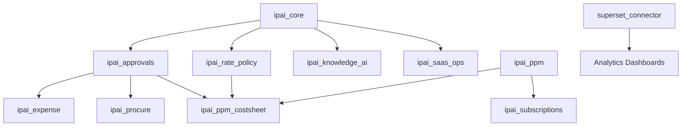

# **InsightPulse Enterprise SaaS Parity PRD v1.0**

**Goal:** unify Clarity PPM + SAP Ariba/SRM + Concur + Salesforce CRM + Tableau BI + Notion AI features inside **Odoo 19 CE + OCA**, tailored for **Advertising Agencies**.

---

## **1  System Overview**

| Layer                  | Scope                                                                                                                                             |
| ---------------------- | ------------------------------------------------------------------------------------------------------------------------------------------------- |
| **Business Core**      | PPM, Job Cost Sheets, Procurement, T&E, Billing, Retainers                                                                                        |
| **Collaboration & AI** | Notion-style AI Workspaces, document RAG, contextual chat                                                                                         |
| **Finance & Ops**      | Accounting, Budgets, Approvals, Analytics, SaaS Ops                                                                                               |
| **Platform**           | Odoo 19 CE + OCA (addons: project, purchase, contract, hr_expense, account_invoice_ocr_google, subscription_oca, document_knowledge, auto_backup) |

---

## **2  Key Roles**

| Role                      | Core Responsibilities                                                |
| ------------------------- | -------------------------------------------------------------------- |
| **Account Manager (AM)**  | Build estimates, manage projects, view rate bands (no vendor names). |
| **Finance Director (FD)** | Approve cost sheets, manage vendors, rate policy, budgets.           |
| **Procurement Officer**   | Vendor onboarding, risk, scorecards.                                 |
| **Creative Lead**         | Tasks / timesheets.                                                  |
| **Client Portal User**    | View shared cost sheets & invoices.                                  |

---

## **3  Epics & Acceptance Criteria**

### **Epic 1 – Unified Approvals Engine (custom)**

* **Goal:** generic multi-stage approval for Cost Sheets, RFQs, Expenses, Invoices, Docs.
* **Base:** none (Enterprise only); build unified model.
* **Done when:** any record type can define stages + actors + escalation; audit trail recorded.
* **Module:** `addons/custom/ipai_approvals/`
* **Implementation**: Sprint 1 (Weeks 1-4)

### **Epic 2 – Vendor-Privacy Cost Sheets (custom)**

* **Goal:** AM sees Role & Rate; FD sees Vendor & Cost.
* **Base:** `project`, `approvals`.
* **Done when:** state flow = Draft → FD Review → Approved → Shared → Invoiced; vendor hidden via record rule.
* **Module:** `addons/custom/ipai_ppm_costsheet/`
* **Implementation**: Sprint 1 (Weeks 1-4)

### **Epic 3 – Rate Policy Automation (custom)**

* **Goal:** compute Public Rate Bands automatically from vendor rate history.
* **Base:** `vendor.rate.card`, cron policy.
* **Done when:** nightly cron updates client rates using P60 over 18 months + 25 % markup + ₱100 rounding.
* **Module:** `addons/custom/ipai_rate_policy/`
* **Implementation**: Sprint 2 (Weeks 5-8)

### **Epic 4 – Procurement & SRM (Ariba parity)**

* **Goal:** supplier onboarding, RFQs, bids, contracts, scorecards.
* **Base:** OCA `purchase_requisition`, `purchase_contract`.
* **Done when:** vendor lifecycle flows from onboarding → scorecard metrics.
* **Module:** `addons/custom/ipai_procure/` (enhancement)
* **Implementation**: Sprint 3 (Weeks 9-12)

### **Epic 5 – Travel & Expense (Concur parity)**

* **Goal:** travel request → itinerary → expense → rebill.
* **Base:** `hr_expense`, OCA OCR.
* **Done when:** OCR receipts auto-fill; approved expenses rebill or offset retainer.
* **Module:** `addons/custom/ipai_expense/` (enhancement)
* **Implementation**: Sprint 3 (Weeks 9-12)

### **Epic 6 – PPM Core (Clarity parity)**

* **Goal:** Program / Project / Roadmap / Budget / Risk / Stage-Gate.
* **Base:** `project`, OCA `project_risk`, `budget_management`.
* **Done when:** budget vs actual dashboards + FD gate approvals per phase.
* **Module:** `addons/custom/ipai_ppm/`
* **Implementation**: Sprint 2 (Weeks 5-8)

### **Epic 7 – Retainers & Subscriptions (SaaS Billing parity)**

* **Goal:** recurring retainer contracts + auto-invoice + dunning.
* **Base:** OCA `contract`, `subscription_oca`, `account_cutoff_accrual`.
* **Done when:** monthly invoice cron, overage detector, portal view.
* **Module:** `addons/custom/ipai_subscriptions/` (enhancement)
* **Implementation**: Sprint 4 (Weeks 13-16)

### **Epic 8 – Knowledge Workspace (Notion parity)**

* **Goal:** AI-assisted collaborative docs per Program/Project.
* **Base:** `document_knowledge`.
* **Done when:** workspace pages + vector index + "/ask" queries answering from project context.
* **Module:** `addons/custom/ipai_knowledge_ai/`
* **Implementation**: Sprint 5 (Weeks 17-20)

### **Epic 9 – Analytics & Dashboards (Tableau parity)**

* **Goal:** MRR/ARR, job profitability, vendor spend, budget vs actual.
* **Base:** `account_analytic_report`, spreadsheet dashboard.
* **Done when:** saved dashboards render < 5 s with filters per Program/Client.
* **Module:** `addons/custom/superset_connector/` (enhancement)
* **Implementation**: Sprint 4 (Weeks 13-16)

### **Epic 10 – SaaS Ops & Multi-Tenancy**

* **Goal:** self-service tenant create + backup + usage billing.
* **Base:** `saas_kit`, `auto_backup`.
* **Done when:** new client DB spins via API + auto daily backup.
* **Module:** `addons/custom/ipai_saas_ops/`
* **Implementation**: Sprint 5 (Weeks 17-20)

---

## **4  Data Model Highlights**

| Object                                  | Key Relations                                                     |
| --------------------------------------- | ----------------------------------------------------------------- |
| `ppm.program`                           | has many `project.project`                                        |
| `project.project`                       | one `analytic_account`; many `job.costsheet`, `contract.contract` |
| `job.costsheet`                         | many `job.costsheet.line`; links Program/Project/Contract         |
| `vendor.rate.card` ↔ `public.rate.band` | drives rates & policy cron                                        |
| `travel.request` / `hr.expense`         | link to Project + Cost Sheet for rebill                           |
| `ai.workspace`                          | attached to any model for context + LLM summaries                 |

---

## **5  Milestones & Timeline**

| Phase                      | Deliverables                                      | Duration |
| -------------------------- | ------------------------------------------------- | -------- |
| **Phase 0 (Weeks 0-2)**    | ipai_core foundation infrastructure               | 2 wks    |
| **Sprint 1 (Weeks 1-4)**   | Unified Approvals + Vendor-Privacy Cost Sheet MVP | 4 wks    |
| **Sprint 2 (Weeks 5-8)**   | Rate Policy Automation + PPM Core                 | 4 wks    |
| **Sprint 3 (Weeks 9-12)**  | Procurement & T&E modules                         | 4 wks    |
| **Sprint 4 (Weeks 13-16)** | Retainers & Subscriptions + Dashboards            | 4 wks    |
| **Sprint 5 (Weeks 17-20)** | Knowledge Workspace + AI integration + SaaS Ops   | 4 wks    |

---

## **6  KPIs**

* Estimate → Invoice cycle ≤ 5 days
* Vendor approval lead time −40 %
* Retainer overage detection ≥ 95 %
* Margin variance ≤ ±2 %
* AI workspace answer precision ≥ 0.9 F1

---

## **7  Technical Architecture**

### **Module Dependencies**

### **Shared Infrastructure (ipai_core)**

**Models**:
- `approval.flow` - Generic approval workflow engine
- `rate.policy` - Rate calculation framework
- `ai.workspace` - Knowledge base connector
- `tenant.manager` - SaaS tenant lifecycle

**Utilities**:
- RLS policy templates
- Audit trail decorators
- Queue job utilities
- Chatter integration helpers

---

## **8  Security & Compliance**

### **Access Control Matrix**

| Role | Cost Sheets | Vendor Data | Budgets | Approvals | AI Workspace |
|------|-------------|-------------|---------|-----------|--------------|
| Account Manager | Read/Write | Hidden | Read | Submit | Read/Write |
| Finance Director | Read/Write | Full Access | Read/Write | Approve | Read |
| Procurement Officer | Read | Full Access | Read | Approve | Read |
| Creative Lead | Read | Hidden | Hidden | None | Read/Write |
| Client Portal | Read (Shared) | Hidden | Hidden | None | Read (Public) |

### **Data Privacy**

- **Vendor Privacy**: Record rules hide vendor_id from non-FD roles
- **Multi-Company**: RLS enforces company_id isolation
- **Audit Trail**: All state changes logged with actor + timestamp
- **Encryption**: Sensitive fields encrypted at rest (API keys, credentials)

---

## **9  Deployment Strategy**

### **Blue-Green Deployment**

**Infrastructure**:
- Production: insightpulseai.net (Odoo 19 + PostgreSQL 15 + Superset)
- Staging: staging.insightpulseai.net (identical stack)
- Development: Local Docker containers

**Rollout Process**:
1. Deploy to staging environment
2. Run automated test suite (80% coverage target)
3. Manual UAT by role (AM, FD, Procurement Officer)
4. Blue-green switch to production
5. Monitor health checks + error logs
6. Rollback capability via Git tags

### **Health Monitoring**

**Metrics**:
- Response time P95 < 500ms
- Database query time P95 < 200ms
- Queue job success rate > 99%
- API error rate < 0.1%

**Dashboards**:
- Prometheus + Grafana for system metrics
- Superset for business KPIs
- Log aggregation via ELK stack

---

## **10  Testing Strategy**

### **Test Pyramid**

**Unit Tests (70%)**:
- Model business logic
- Compute methods
- Constraint validations
- Cron job logic

**Integration Tests (20%)**:
- Approval workflow end-to-end
- Invoice generation from cost sheets
- OCR → Expense creation
- RFQ → PO → GRN 3-way match

**End-to-End Tests (10%)**:
- User journey: AM creates cost sheet → FD approves → Client views
- Retainer overage: Usage exceeds limit → Alert triggered → Invoice generated
- Vendor onboarding: PR submission → Multi-round RFQ → PO creation

### **Test Coverage Targets**

| Module | Unit % | Integration % | E2E % |
|--------|--------|---------------|-------|
| ipai_core | 90% | - | - |
| ipai_approvals | 85% | 80% | 75% |
| ipai_ppm_costsheet | 85% | 80% | 80% |
| ipai_rate_policy | 90% | 70% | - |
| ipai_procure | 80% | 75% | 70% |
| ipai_expense | 80% | 75% | 70% |
| ipai_ppm | 85% | 80% | 75% |
| ipai_subscriptions | 85% | 80% | 75% |
| ipai_knowledge_ai | 75% | 70% | 65% |
| ipai_saas_ops | 80% | 75% | 70% |

---

## **11  Risk Mitigation**

### **Technical Risks**

| Risk | Probability | Impact | Mitigation |
|------|-------------|--------|------------|
| OCA module compatibility issues | Medium | High | Pin specific OCA versions; test in staging |
| AI workspace accuracy < 0.9 F1 | Medium | Medium | Iterative prompt engineering; pgvector tuning |
| Performance degradation (>100 modules) | Low | High | Database optimization; connection pooling; caching |
| Multi-tenancy security breach | Low | Critical | Rigorous RLS testing; security audit |

### **Business Risks**

| Risk | Probability | Impact | Mitigation |
|------|-------------|--------|------------|
| User adoption resistance | Medium | High | Phased rollout; training; change management |
| Scope creep beyond 22 weeks | High | Medium | Sprint reviews; MVP focus; backlog prioritization |
| Key developer departure | Medium | High | Documentation; code reviews; knowledge transfer |

---

## **12  Success Criteria**

### **Go-Live Checklist**

- [ ] All 10 epics acceptance criteria met
- [ ] KPI targets achieved (estimate→invoice ≤5d, overage ≥95%, etc.)
- [ ] Security audit passed (no Critical/High vulnerabilities)
- [ ] Performance benchmarks met (P95 <500ms response time)
- [ ] Test coverage ≥80% across all modules
- [ ] User training completed (AM, FD, Procurement Officer roles)
- [ ] Documentation complete (admin guide, user manuals, API specs)
- [ ] Production deployment successful with zero downtime
- [ ] Monitoring dashboards operational (Prometheus, Grafana, Superset)
- [ ] Backup/restore tested successfully

### **Post-Launch Metrics (90 days)**

- [ ] User adoption ≥90% (active users per role)
- [ ] Estimate→Invoice cycle reduced by ≥40%
- [ ] Vendor approval time reduced by ≥40%
- [ ] Retainer overage detection accuracy ≥95%
- [ ] Margin variance within ±2%
- [ ] AI workspace query satisfaction ≥4.5/5.0
- [ ] System uptime ≥99.5%
- [ ] Support ticket volume <5 per week

---

**Owner:** InsightPulse AI Engineering Team
**Repository:** `insightpulse-odoo` (https://github.com/jgtolentino/insightpulse-odoo)
**License:** AGPL-3.0
**Baseline Environment:** Odoo 19 CE + OCA Add-ons + PostgreSQL 15 + pgVector
**Version:** 1.0.0
**Last Updated:** 2025-10-29
**Status:** 🟡 Implementation Planning Phase
