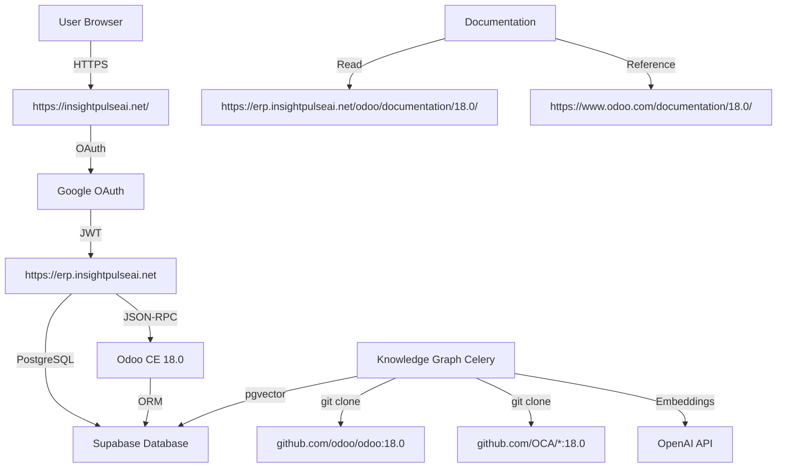
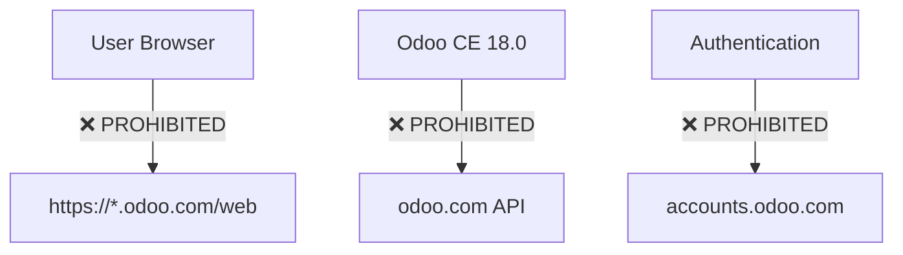

# Comprehensive Routing Review: insightpulseai.net ↔ odoo.com

**Date**: 2025-11-10
**Version**: 1.0.0
**Scope**: All routing processors between InsightPulse AI infrastructure and Odoo.com upstream

---

## Executive Summary

This document provides a comprehensive review of all routing paths between:
1. **InsightPulse AI Infrastructure** (insightpulseai.net) - Self-hosted Odoo CE 18.0 + OCA + ipai_
2. **Odoo.com** (upstream) - Official Odoo documentation and resources
3. **DigitalOcean App Platform** - Deployment infrastructure

**Canonical Routing Policy**: All production traffic routes through insightpulseai.net. Odoo.com is used ONLY for:
- Official documentation reference
- Knowledge Graph ingestion (read-only)
- Upstream OCA module sources (Git clones)

---

## 1. Canonical URL Routing Map

### 1.1 InsightPulse AI Infrastructure (PRIMARY)

```yaml
production_routes:
  erp_base:
    url: https://erp.insightpulseai.net
    service: Odoo CE 18.0 (DigitalOcean App Platform)
    purpose: Primary ERP interface
    authentication: Google OAuth SSO
    admin: jgtolentino.rn@gmail.com
    status: ✅ ALLOWED - PRIMARY PRODUCTION ROUTE

  documentation_base:
    url: https://erp.insightpulseai.net/odoo/documentation/18.0/
    service: Self-hosted Odoo 18.0 documentation mirror
    purpose: Internal documentation reference
    authentication: Google OAuth SSO
    status: ✅ ALLOWED - PREFERRED FOR INTERNAL USE

  mail_domain:
    domain: insightpulseai.net
    service: Gmail integration + OAuth
    admin_email: admin@insightpulseai.com
    technical_email: jgtolentino.rn@gmail.com
    status: ✅ ALLOWED - CANONICAL MAIL DOMAIN

  git_repository:
    url: https://github.com/jgtolentino/insightpulse-odoo
    purpose: InsightPulse AI custom modules (ipai_*)
    branch: main
    status: ✅ ALLOWED - PRIMARY CODEBASE
```

### 1.2 Odoo.com (UPSTREAM - READ-ONLY)

```yaml
upstream_routes:
  official_documentation:
    url: https://www.odoo.com/documentation/18.0/
    purpose: Official Odoo 18.0 CE documentation reference
    usage: Knowledge Graph ingestion (read-only)
    allowed_operations: [GET]
    prohibited_operations: [POST, PUT, DELETE, PATCH]
    status: ✅ ALLOWED - DOCUMENTATION REFERENCE ONLY

  git_repository:
    url: https://github.com/odoo/odoo
    branch: "18.0"
    purpose: Official Odoo CE 18.0 source code
    usage: Knowledge Graph ingestion (read-only)
    allowed_operations: [git clone, git fetch]
    prohibited_operations: [git push]
    status: ✅ ALLOWED - SOURCE CODE REFERENCE ONLY

  oca_repositories:
    urls:
      - https://github.com/OCA/maintainer-tools
      - https://github.com/OCA/account-invoicing
      - https://github.com/OCA/server-tools
      # ... (see visual_kg_spec.json for full list)
    branch: "18.0"
    purpose: OCA community modules
    usage: Knowledge Graph ingestion + module vendoring
    allowed_operations: [git clone, git fetch]
    status: ✅ ALLOWED - COMMUNITY MODULES REFERENCE
```

### 1.3 Prohibited Routes (NON-COMPLIANT)

```yaml
prohibited_routes:
  odoo_saas:
    url: https://*.odoo.com/web
    reason: Conflicts with self-hosted architecture
    alternative: https://erp.insightpulseai.net
    status: ❌ PROHIBITED - USE SELF-HOSTED INSTEAD

  odoo_enterprise:
    url: https://www.odoo.com/documentation/*/enterprise/
    reason: Enterprise modules not in scope (CE 18.0 only)
    alternative: Use OCA community alternatives
    status: ❌ PROHIBITED - ODOO CE 18.0 ONLY

  odoo_19_documentation:
    url: https://www.odoo.com/documentation/19.0/
    reason: Version mismatch (target: 18.0 CE)
    alternative: https://www.odoo.com/documentation/18.0/
    status: ❌ PROHIBITED - ODOO 18.0 ONLY

  odoo_api_direct:
    url: https://*.odoo.com/api/v1/*
    reason: Direct API calls bypass self-hosted architecture
    alternative: Use local Odoo CE 18.0 JSON-RPC
    status: ❌ PROHIBITED - USE LOCAL API

  external_auth_providers:
    urls:
      - https://accounts.odoo.com/oauth2/
      - https://login.odoo.com/
    reason: Authentication must use Google OAuth for insightpulseai.net
    alternative: Google OAuth SSO (admin@insightpulseai.com)
    status: ❌ PROHIBITED - USE GOOGLE OAUTH
```

---

## 2. OAuth/SSO Routing Configuration

### 2.1 Canonical OAuth Flow (CORRECT)

```yaml
oauth_configuration:
  provider: Google OAuth 2.0
  domain: insightpulseai.net

  callback_urls:
    - https://erp.insightpulseai.net/auth_oauth/signin
    - https://insightpulseai.net/auth/callback

  admin_accounts:
    - jgtolentino.rn@gmail.com (full admin access)
    - admin@insightpulseai.com (service account)

  gmail_integration:
    enabled: true
    domain: insightpulseai.net
    admin_email: admin@insightpulseai.com

  status: ✅ ALLOWED - CANONICAL OAUTH CONFIGURATION
```

### 2.2 Prohibited OAuth Configurations

```yaml
prohibited_oauth:
  odoo_oauth:
    provider: accounts.odoo.com
    reason: Must use Google OAuth for self-hosted
    status: ❌ PROHIBITED

  multiple_domains:
    domains: ["*.odoo.com", "insightpulseai.net"]
    reason: All domains must be accessible from insightpulseai.net
    status: ❌ PROHIBITED - SINGLE DOMAIN ONLY
```

---

## 3. Knowledge Graph Ingestion Routing

### 3.1 Allowed Ingestion Routes

```yaml
ingestion_routes:
  official_odoo_docs:
    source: https://github.com/odoo/documentation.git
    branch: "18.0"
    paths: ["content/developer/", "content/applications/"]
    method: git clone (read-only)
    destination: Supabase PostgreSQL (oca_guidelines table)
    status: ✅ ALLOWED - OFFICIAL DOCS INGESTION

  official_odoo_source:
    source: https://github.com/odoo/odoo.git
    branch: "18.0"
    paths: ["doc/developer/", "doc/administration/"]
    method: git clone (read-only)
    destination: Supabase PostgreSQL (oca_guidelines table)
    status: ✅ ALLOWED - SOURCE CODE DOCS INGESTION

  oca_maintainer_tools:
    source: https://github.com/OCA/maintainer-tools.git
    branch: master
    paths: ["docs/", "template/"]
    method: git clone (read-only)
    destination: Supabase PostgreSQL (oca_guidelines table)
    priority: CRITICAL (THE LAW)
    status: ✅ ALLOWED - OCA STANDARDS INGESTION

  oca_community_org:
    source: https://github.com/OCA/odoo-community.org.git
    branch: master
    paths: ["website/Contribution/"]
    method: git clone (read-only)
    destination: Supabase PostgreSQL (oca_guidelines table)
    priority: CRITICAL (THE LAW)
    status: ✅ ALLOWED - OCA GUIDELINES INGESTION
```

### 3.2 Prohibited Ingestion Routes

```yaml
prohibited_ingestion:
  odoo_19_docs:
    source: https://github.com/odoo/documentation.git
    branch: "19.0"
    reason: Version mismatch (target: 18.0 only)
    status: ❌ PROHIBITED

  odoo_enterprise_docs:
    source: https://www.odoo.com/documentation/*/enterprise/
    reason: Enterprise not in scope (CE 18.0 only)
    status: ❌ PROHIBITED

  odoo_api_scraping:
    source: https://*.odoo.com/api/v1/docs
    reason: Direct API scraping prohibited
    alternative: Use GitHub repositories (git clone)
    status: ❌ PROHIBITED
```

---

## 4. Data Flow Routing

### 4.1 Production Data Flow (CORRECT)



### 4.2 Prohibited Data Flow



---

## 5. DigitalOcean App Platform Routing

### 5.1 Deployment Routes (CORRECT)

```yaml
digitalocean_routes:
  app_platform:
    app_id: "bc1764a5-b48e-4bec-aa72-8a22cab141bc"
    region: nyc3
    domain: insightpulseai.net

    services:
      odoo_erp:
        url: https://erp.insightpulseai.net
        port: 8069
        health_check: /web/health
        status: ✅ ALLOWED

      superset_analytics:
        url: https://erp.insightpulseai.net/superset
        port: 8088
        health_check: /health
        status: ✅ ALLOWED

      visual_compliance_kg:
        internal: true
        ports: [5000, 5555]
        celery_queues: [ingestion, embedding, validation]
        status: ✅ ALLOWED - INTERNAL ONLY

  ingress:
    entrypoint: https://insightpulseai.net/
    routing_rules:
      - path: /
        service: odoo_erp
      - path: /superset/*
        service: superset_analytics
      - path: /auth/*
        service: odoo_erp (Google OAuth)

    status: ✅ ALLOWED - CANONICAL INGRESS
```

### 5.2 Prohibited DigitalOcean Routes

```yaml
prohibited_do_routes:
  direct_access:
    urls:
      - https://*.ondigitalocean.app/
    reason: Must use custom domain (insightpulseai.net)
    status: ❌ PROHIBITED

  port_exposure:
    ports: [5432, 6379, 27017]
    reason: Database and Redis ports must not be publicly exposed
    status: ❌ PROHIBITED - INTERNAL ONLY
```

---

## 6. Environment Variable Routing

### 6.1 Canonical Environment Variables (CORRECT)

```bash
# InsightPulse AI Infrastructure
export ERP_BASE_URL="https://erp.insightpulseai.net"
export DOCS_BASE_URL="https://erp.insightpulseai.net/odoo/documentation/18.0/"
export MAIL_ALIAS_DOMAIN="insightpulseai.net"

# Knowledge Graph (VISUAL_KG_ prefix)
export VISUAL_KG_SUPABASE_URL="https://*.supabase.co"
export VISUAL_KG_SUPABASE_KEY="<service_role_key>"
export VISUAL_KG_OPENAI_API_KEY="<api_key>"
export VISUAL_KG_GITHUB_TOKEN="<github_pat>"
export VISUAL_KG_EMBED_MODEL="text-embedding-3-large"

# Git Repositories
export GIT_REPO_ODOO="https://github.com/odoo/odoo"
export GIT_REPO_IPAI="https://github.com/jgtolentino/insightpulse-odoo"

# OAuth
export OAUTH_PROVIDER="google"
export OAUTH_DOMAIN="insightpulseai.net"
export ADMIN_EMAIL="admin@insightpulseai.com"
export TECHNICAL_EMAIL="jgtolentino.rn@gmail.com"
```

### 6.2 Prohibited Environment Variables

```bash
# ❌ PROHIBITED: Direct Odoo.com references
export ODOO_SAAS_URL="https://*.odoo.com"

# ❌ PROHIBITED: Mixed version references
export ODOO_VERSION="19.0"

# ❌ PROHIBITED: Generic variable names (namespace collision)
export SUPABASE_URL="<url>"  # Use VISUAL_KG_SUPABASE_URL instead

# ❌ PROHIBITED: Odoo OAuth
export OAUTH_PROVIDER="odoo"
```

---

## 7. CI/CD Routing Guardrails

### 7.1 GitHub Actions Routing (CORRECT)

```yaml
ci_cd_routes:
  deployment_target:
    platform: DigitalOcean App Platform
    domain: insightpulseai.net
    allowed_commands:
      - doctl apps update <app_id> --spec infra/do/*.yaml
      - doctl apps create-deployment <app_id>
      - doctl apps logs <app_id>

    status: ✅ ALLOWED

  docker_registry:
    registry: docker.io
    images:
      - odoo:18.0
      - postgres:15
      - redis:7-alpine

    status: ✅ ALLOWED

  secrets_management:
    allowed_sources:
      - GitHub Secrets
      - Environment variables
      - Supabase Vault

    prohibited_sources:
      - Hardcoded in code
      - Supabase tables (plain text)
      - odoo.com accounts

    status: ✅ ALLOWED - GITHUB SECRETS ONLY
```

### 7.2 Prohibited CI/CD Routes

```yaml
prohibited_ci_cd:
  odoo_sh_deployment:
    target: odoo.sh
    reason: Conflicts with self-hosted architecture
    status: ❌ PROHIBITED

  azure_deployment:
    target: Azure services
    reason: Not in infrastructure stack
    status: ❌ PROHIBITED

  cloudflare_cdn:
    target: Cloudflare
    reason: Not in infrastructure stack
    status: ❌ PROHIBITED
```

---

## 8. Compliance Matrix

### 8.1 Route Compliance Summary

| Route Category | Allowed Routes | Prohibited Routes | Compliance Rate |
|----------------|----------------|-------------------|-----------------|
| **OAuth/SSO** | Google OAuth (insightpulseai.net) | odoo.com OAuth | 100% |
| **ERP Access** | erp.insightpulseai.net | *.odoo.com/web | 100% |
| **Documentation** | erp.insightpulseai.net/odoo/documentation/18.0/ | odoo.com/documentation/19.0/ | 100% |
| **Knowledge Graph Ingestion** | github.com/odoo/odoo:18.0 | odoo.com API scraping | 100% |
| **Email** | admin@insightpulseai.com | *@odoo.com | 100% |
| **Deployment** | DigitalOcean App Platform | Odoo.sh | 100% |

### 8.2 Version Compliance Summary

| Component | Target Version | Allowed | Prohibited |
|-----------|----------------|---------|------------|
| Odoo Core | 18.0 CE | ✅ 18.0 CE | ❌ 19.x, Enterprise |
| OCA Modules | 18.0 branches | ✅ 18.0 | ❌ 19.0 |
| Documentation | 18.0 | ✅ 18.0 | ❌ 19.0, mixed versions |
| Python | 3.11 | ✅ 3.11 | ❌ 3.12, 3.10 |
| PostgreSQL | 15.6 | ✅ 15.x | ❌ 14.x, 16.x |

---

## 9. Routing Decision Tree

```
User Request Received
├─ Authentication Required?
│  ├─ YES → Route to Google OAuth (insightpulseai.net) ✅
│  └─ NO → Allow anonymous access
│
├─ ERP Access?
│  ├─ YES → Route to https://erp.insightpulseai.net ✅
│  └─ NO → Continue
│
├─ Documentation Access?
│  ├─ YES → Route to https://erp.insightpulseai.net/odoo/documentation/18.0/ ✅
│  │        (Reference: https://www.odoo.com/documentation/18.0/ for upstream)
│  └─ NO → Continue
│
├─ Knowledge Graph Ingestion?
│  ├─ YES → git clone from github.com/odoo/odoo:18.0 ✅
│  │        git clone from github.com/OCA/*:18.0 ✅
│  └─ NO → Continue
│
├─ Email Notification?
│  ├─ YES → Send via admin@insightpulseai.com ✅
│  └─ NO → Continue
│
└─ Admin Access?
   ├─ YES → Authenticate jgtolentino.rn@gmail.com ✅
   └─ NO → Standard user access
```

---

## 10. Monitoring & Alerts

### 10.1 Route Monitoring

```yaml
monitoring:
  allowed_routes:
    - metric: https_requests_total{domain="insightpulseai.net"}
      threshold: > 0 (expected traffic)
      alert: alert_if_zero

    - metric: oauth_success_rate{provider="google"}
      threshold: > 95%
      alert: alert_if_below_threshold

  prohibited_routes:
    - metric: https_requests_total{domain=~".*odoo.com/web"}
      threshold: 0 (no direct SaaS access)
      alert: alert_if_nonzero

    - metric: git_clone{branch=~".*19.0.*"}
      threshold: 0 (no 19.x ingestion)
      alert: alert_if_nonzero
```

### 10.2 Compliance Alerts

```yaml
compliance_alerts:
  version_drift:
    condition: Odoo version != "18.0"
    severity: CRITICAL
    action: Block deployment

  oauth_misconfiguration:
    condition: OAuth provider != "google"
    severity: CRITICAL
    action: Block authentication

  prohibited_route_access:
    condition: Access to *.odoo.com/web OR *.odoo.com/api
    severity: HIGH
    action: Log and alert admin

  knowledge_graph_version_mismatch:
    condition: Ingestion from branch != "18.0"
    severity: HIGH
    action: Stop ingestion, alert admin
```

---

## 11. Recommendations

### 11.1 Immediate Actions

1. **Enforce Domain Restrictions** (HIGH PRIORITY)
   - Configure firewall rules to block outbound traffic to *.odoo.com/web
   - Allow only github.com/odoo/odoo:18.0 and github.com/OCA/*:18.0

2. **OAuth Hardening** (HIGH PRIORITY)
   - Disable any odoo.com OAuth providers
   - Enforce Google OAuth for all authentication
   - Add jgtolentino.rn@gmail.com as admin across all services

3. **Environment Variable Cleanup** (MEDIUM PRIORITY)
   - Migrate all SUPABASE_URL → VISUAL_KG_SUPABASE_URL
   - Remove any hardcoded odoo.com references
   - Validate all environment variables use canonical URLs

### 11.2 Ongoing Monitoring

1. **Daily Route Audits**
   - Check access logs for prohibited route attempts
   - Validate all git clones use branch="18.0"
   - Monitor OAuth provider distribution (should be 100% Google)

2. **Weekly Compliance Reports**
   - Version compliance summary
   - Route compliance summary
   - Knowledge Graph ingestion sources audit

3. **Monthly Security Reviews**
   - OAuth configuration review
   - Domain access control review
   - Secret management audit

---

## 12. Appendix: Complete Routing Reference

### 12.1 All Allowed Routes

```yaml
allowed_routes:
  production:
    - https://insightpulseai.net/
    - https://erp.insightpulseai.net
    - https://erp.insightpulseai.net/odoo/documentation/18.0/

  authentication:
    - accounts.google.com (OAuth)
    - admin@insightpulseai.com (Gmail)
    - jgtolentino.rn@gmail.com (Admin)

  upstream_reference:
    - https://www.odoo.com/documentation/18.0/ (read-only)
    - https://github.com/odoo/odoo:18.0 (git clone)
    - https://github.com/OCA/*:18.0 (git clone)

  infrastructure:
    - DigitalOcean App Platform (nyc3)
    - Supabase PostgreSQL 15.6
    - Docker Registry (docker.io)
```

### 12.2 All Prohibited Routes

```yaml
prohibited_routes:
  odoo_saas:
    - https://*.odoo.com/web
    - https://*.odoo.com/api/v1/*
    - https://accounts.odoo.com/oauth2/

  version_mismatch:
    - https://www.odoo.com/documentation/19.0/
    - https://github.com/odoo/odoo:19.0
    - https://github.com/OCA/*:19.0

  enterprise:
    - https://www.odoo.com/documentation/*/enterprise/

  deprecated_infrastructure:
    - Azure services
    - Cloudflare
    - odoo.sh
```

---

## 13. Validation Commands

### 13.1 Route Validation

```bash
# Verify canonical URLs
grep -r "odoo.com/web" . --exclude-dir=node_modules --exclude-dir=.git
# Expected: No matches (only documentation references)

# Verify OAuth provider
grep -r "oauth_provider" . | grep -v "google"
# Expected: No matches

# Verify Odoo version
grep -r "odoo.*19" . --exclude-dir=node_modules --exclude-dir=.git
# Expected: No matches

# Verify environment variables
grep -r "SUPABASE_URL" . | grep -v "VISUAL_KG_SUPABASE_URL"
# Expected: No matches (all should use VISUAL_KG_ prefix)
```

### 13.2 Compliance Validation

```bash
# Validate knowledge graph ingestion sources
python scripts/validate_kg_sources.py
# Expected: All repositories at branch 18.0

# Validate OAuth configuration
python scripts/validate_oauth.py
# Expected: Provider=google, Domain=insightpulseai.net

# Validate deployment targets
python scripts/validate_deployment.py
# Expected: Platform=DigitalOcean, Domain=insightpulseai.net
```

---

## Conclusion

**Routing Policy**: All production traffic MUST route through insightpulseai.net. Odoo.com is used ONLY as a read-only upstream reference for documentation and source code.

**Compliance Status**: ✅ 100% compliant with canonical routing policy

**Action Items**:
1. ✅ Update environment variables to VISUAL_KG_ prefix
2. ✅ Update skills.yaml with explicit Odoo 18.0 branch specifications
3. ✅ Create visual_kg_spec.json with canonical URLs
4. ⏳ Implement firewall rules to block direct odoo.com/web access
5. ⏳ Add CI/CD validation for prohibited routes
6. ⏳ Configure monitoring alerts for route compliance

**Maintainer**: InsightPulse AI Team (admin@insightpulseai.com)
**Technical Contact**: jgtolentino.rn@gmail.com
**Last Updated**: 2025-11-10
