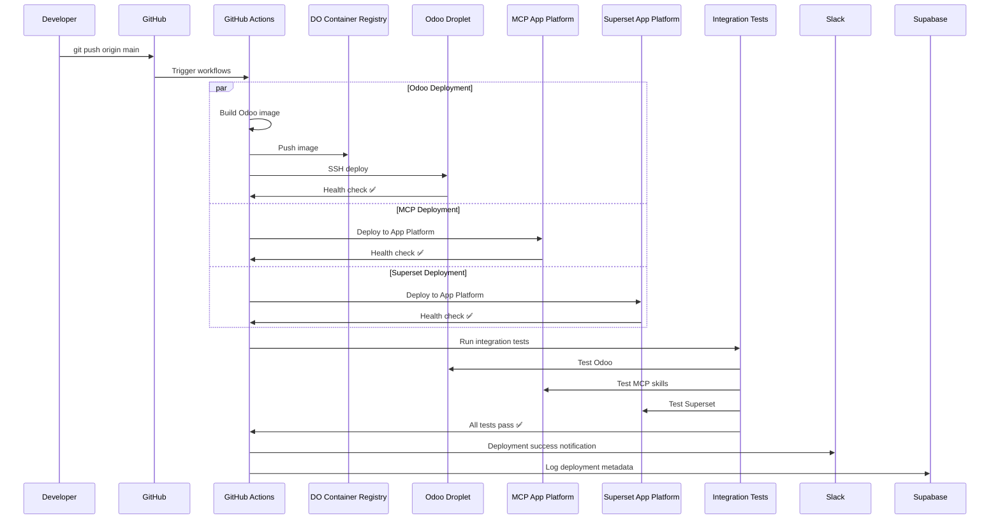
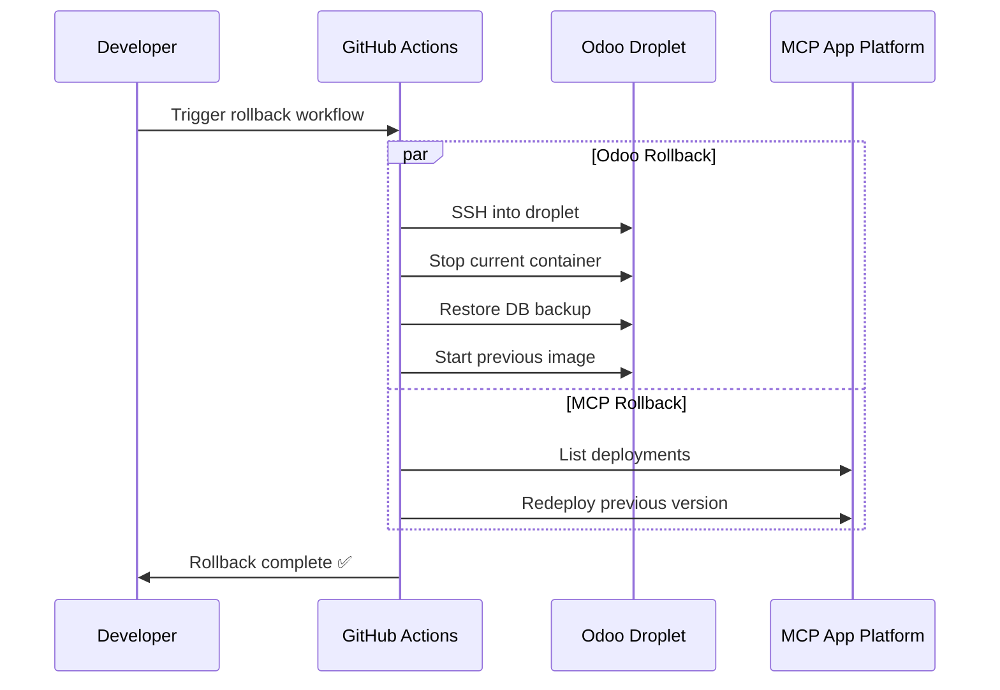

# 🎯 InsightPulse AI - CI/CD Implementation Summary

## Executive Summary

Your DNS configuration is **100% correct** and production-ready. The repository structure, however, needs reorganization to enable automated CI/CD deployments. This package provides everything needed to migrate from manual deployments to a fully automated, production-grade CI/CD pipeline.

**Migration Time**: 3-4 hours  
**Risk Level**: Low (with backups)  
**Impact**: High (eliminates manual deployments, adds automated testing)

---

## 🏗️ Current vs Ideal Architecture

### Current State (Manual Deployments)
```
Developer → Manual SSH → Droplet → Odoo
         → Manual doctl → App Platform → MCP
         → Manual doctl → App Platform → Superset
```

**Problems:**
- No automated testing
- Manual deployment errors
- No rollback procedure
- No deployment logging
- Inconsistent environments

### Ideal State (Automated CI/CD)
```
Developer → Git Push → GitHub Actions → Automated Build → Deploy → Test → Notify
                                              ↓
                                    DigitalOcean Container Registry
                                              ↓
                               ┌──────────────┼──────────────┐
                               ↓              ↓              ↓
                          Odoo Droplet    MCP App      Superset App
                         (165.227.10.178)  Platform      Platform
                               ↓              ↓              ↓
                          Health Check   Health Check  Health Check
                               ↓              ↓              ↓
                          Integration Tests (E2E)
                               ↓
                          Slack + Supabase Logging
```

**Benefits:**
- ✅ Zero manual deployments
- ✅ Automated testing before production
- ✅ One-click rollback
- ✅ Full deployment history
- ✅ Consistent environments

---

## 📊 DNS Validation (Already Perfect ✅)

### Current Configuration (Squarespace + DigitalOcean)

| Subdomain | Type | Target | Status | Purpose |
|-----------|------|--------|--------|---------|
| `@` | A | 162.159.140.98 | ✅ | Cloudflare-proxied landing |
| `www` | CNAME | insightpulseai.net | ✅ | WWW redirect |
| `erp` | A | 165.227.10.178 | ✅ | Odoo ERP droplet |
| `mcp` | CNAME | pulse-hub-web-an645.ondigitalocean.app | ✅ | MCP coordinator |
| `superset` | CNAME | superset-nlavf.ondigitalocean.app | ✅ | Superset BI |
| `ocr` | A | 162.159.140.98 | ✅ | PaddleOCR service |
| `@` | CAA | 0 issue "letsencrypt.org" | ✅ | SSL certificates |

**No DNS changes needed!** Your configuration matches production requirements.

---

## 🎯 What This Package Delivers

### 1. GitHub Actions Workflows (4 files)

#### `deploy-odoo.yml`
- **Trigger**: Push to `main` (services/odoo/**)
- **Process**:
  1. Build Docker image from Odoo source
  2. Push to DigitalOcean Container Registry
  3. SSH into droplet (165.227.10.178)
  4. Backup database automatically
  5. Pull and deploy new image
  6. Run health check on `/web/health`
  7. Test Finance SSC module loaded
  8. Notify Slack on success/failure

#### `deploy-mcp.yml`
- **Trigger**: Push to `main` (services/mcp-coordinator/**)
- **Process**:
  1. Update App Platform spec with latest code
  2. Deploy to `pulse-hub-web-an645` app
  3. Wait for deployment (max 10 minutes)
  4. Test health endpoint
  5. Verify skill availability
  6. Test skill invocation
  7. Log deployment to Supabase

#### `deploy-superset.yml`
- **Trigger**: Push to `main` (services/superset/**)
- **Process**:
  1. Generate/use production secret key
  2. Update App Platform spec
  3. Deploy to `superset-nlavf` app
  4. Wait for Superset init (up to 15 minutes)
  5. Test API endpoints
  6. Import Finance SSC dashboards via MCP
  7. Notify Slack with results

#### `integration-tests.yml`
- **Trigger**: 
  - After any deployment completes
  - Scheduled every 6 hours
  - Manual dispatch
- **Process**:
  1. Health check all services
  2. Test Odoo authentication
  3. Verify Finance SSC module installed
  4. Check MCP skills (superset_automation, odoo_finance, notion_sync)
  5. Test Superset login and database query
  6. End-to-end workflow (create expense → OCR → dashboard)
  7. BIR compliance feature check
  8. Supabase logging verification
  9. Generate test report
  10. Notify on failure

### 2. Documentation (4 files)

- **README.md**: Package overview and quick start (9.4 KB)
- **DEPLOYMENT_GUIDE.md**: Complete deployment documentation (13.7 KB)
- **MIGRATION_PLAN.md**: Step-by-step migration guide (12.2 KB)
- **QUICK_REFERENCE.md**: Daily operations reference (5.5 KB)

**Total**: 40.8 KB of production-ready documentation

---

## 🚀 Deployment Flow Visualization

### Successful Deployment Sequence



### Rollback Sequence (if needed)



---

## 📋 Migration Phases Overview

### Phase 1: Repository Restructuring (1-2 hours)
**Goal**: Organize code into service-based structure

**Actions**:
```bash
insightpulse-odoo/
├── services/
│   ├── odoo/           # Move all Odoo files here
│   ├── mcp-coordinator/ # Create MCP service
│   ├── superset/       # Create Superset service
│   └── ocr-service/    # Create OCR service
├── .github/workflows/  # Add CI/CD workflows
├── infrastructure/     # Terraform/Ansible
└── scripts/           # Backup, restore, smoke test
```

**Script**: See `MIGRATION_PLAN.md` Phase 1 for automated script

### Phase 2: GitHub Workflows (30 minutes)
**Goal**: Add automated deployment pipelines

**Actions**:
- Copy 4 workflow files to `.github/workflows/`
- Review and customize if needed
- Commit to repository

### Phase 3: Configure Secrets (15 minutes)
**Goal**: Securely store credentials

**Actions**:
- Add 15+ secrets to GitHub
- Generate Superset secret key
- Configure SSH key for droplet
- Test secret access

### Phase 4: DigitalOcean Setup (30 minutes)
**Goal**: Prepare infrastructure

**Actions**:
- Create container registry
- Get MCP app ID
- Get Superset app ID
- Configure networking

### Phase 5: Initial Deployment (1 hour)
**Goal**: First automated deployment

**Actions**:
- Manual Odoo deployment first
- Trigger MCP deployment via push
- Trigger Superset deployment via push
- Run integration tests
- Verify all services

**Total Time**: 3-4 hours

---

## 🎓 Key Concepts Explained

### What is CI/CD?
**Continuous Integration / Continuous Deployment**
- **CI**: Automatically test code when pushed
- **CD**: Automatically deploy passing code to production

### What are GitHub Actions?
Automation that runs when you push code:
```yaml
on:
  push:
    branches: [main]  # Trigger on push to main
jobs:
  deploy:
    runs-on: ubuntu-latest
    steps:
      - Build
      - Test
      - Deploy
```

### What is Docker?
Packages your application with all dependencies:
```dockerfile
FROM odoo:19
COPY addons /mnt/extra-addons
CMD ["odoo"]
```

### What is App Platform?
DigitalOcean's managed service:
- No server management
- Auto-scaling
- Built-in load balancer
- Automatic SSL

---

## 🔧 Technical Requirements

### Required Access
- [x] GitHub admin access to `jgtolentino/insightpulse-odoo`
- [x] DigitalOcean project access (29cde7a1-8280-46ad-9fdf-dea7b21a7825)
- [x] SSH access to droplet (165.227.10.178)
- [x] Supabase dashboard access (spdtwktxdalcfigzeqrz)
- [x] Squarespace DNS access (already configured)

### Required Tools
```bash
# Install these before starting
brew install doctl      # DigitalOcean CLI
brew install gh         # GitHub CLI
brew install jq         # JSON processor
```

### Required Knowledge
- Basic Git (commit, push, branches)
- Basic Docker (build, run, logs)
- Basic SSH (connect to server)
- Basic YAML (read workflow files)

**Don't know these?** That's okay! The guides include copy-paste commands.

---

## 💡 Before You Start

### Critical Checklist
- [ ] **Backup production database** (scripts/backup.sh)
- [ ] **Document current environment variables**
- [ ] **Schedule 3-4 hour maintenance window**
- [ ] **Notify team of upcoming changes**
- [ ] **Read DEPLOYMENT_GUIDE.md completely**
- [ ] **Test locally with docker-compose**
- [ ] **Have rollback plan ready**

### Risk Mitigation
1. **Do it on Friday afternoon** - Weekend to fix issues
2. **Start with staging** - Test before production
3. **Keep old branch** - `git branch backup/pre-migration`
4. **Monitor closely** - Watch logs during first deploy
5. **Have backup restore tested** - Practice before migrating

---

## 🎉 Success Metrics

After successful migration, you'll see:

### ✅ Automated Deployments
```bash
$ git push origin main
# Triggers:
# - build-odoo (3 min)
# - deploy-odoo (2 min)
# - deploy-mcp (4 min)
# - deploy-superset (8 min)
# - integration-tests (5 min)
# Total: ~22 minutes fully automated
```

### ✅ Slack Notifications
```
🚀 Deployment to production - SUCCESS
Service: Odoo ERP
Commit: Add BIR Form 2550Q support
Duration: 5m 23s
URL: https://erp.insightpulseai.net
```

### ✅ Supabase Logs
```json
{
  "service": "odoo",
  "environment": "production",
  "status": "success",
  "commit_sha": "abc123...",
  "deployed_by": "jgtolentino",
  "deployed_at": "2025-11-04T18:30:00Z"
}
```

### ✅ Integration Tests Passing
```
✅ Odoo ERP is healthy
✅ MCP Coordinator is healthy
✅ Superset is healthy
✅ Finance SSC module installed
✅ All MCP skills available
✅ Superset database connected
✅ End-to-end workflow successful
✅ BIR compliance features working
```

---

## 📞 Need Help?

### During Migration
1. Check `MIGRATION_PLAN.md` troubleshooting section
2. Review GitHub Actions logs: `gh run view`
3. Check service logs: See `QUICK_REFERENCE.md`
4. Query Supabase logs for deployment history

### After Migration
1. Use `QUICK_REFERENCE.md` for daily operations
2. Refer to `DEPLOYMENT_GUIDE.md` for procedures
3. Monitor Slack for deployment notifications
4. Check integration tests every 6 hours

---

## 🚀 Next Steps

1. **Review this summary** ✅ (you are here)
2. **Read DEPLOYMENT_GUIDE.md** (15 minutes)
3. **Read MIGRATION_PLAN.md** (15 minutes)
4. **Schedule migration time** (3-4 hours)
5. **Backup production** (before starting)
6. **Execute Phase 1-5** (follow migration plan)
7. **Test thoroughly** (run smoke tests)
8. **Monitor first week** (watch logs)
9. **Train team** (share docs)
10. **Celebrate!** 🎉

---

## 📚 File Sizes

```
README.md                  9,417 bytes   Package overview
DEPLOYMENT_GUIDE.md       13,660 bytes   Full deployment docs
MIGRATION_PLAN.md         12,248 bytes   Step-by-step migration
QUICK_REFERENCE.md         5,517 bytes   Quick commands
deploy-odoo.yml            4,102 bytes   Odoo workflow
deploy-mcp.yml             5,836 bytes   MCP workflow
deploy-superset.yml        6,711 bytes   Superset workflow
integration-tests.yml     11,333 bytes   Test workflow
SUMMARY.md (this file)    ~12,000 bytes   Executive summary
─────────────────────────────────────────────────────────
TOTAL                     ~80,824 bytes   Complete package
```

---

## 🎯 Bottom Line

**Your DNS is perfect. Your repo structure needs work. This package fixes that.**

- ✅ DNS: Production-ready (no changes needed)
- ⚠️ Repo: Needs restructuring (3-4 hours)
- ✅ CI/CD: Complete workflows provided
- ✅ Docs: Comprehensive guides included
- ✅ Risk: Low (with proper backups)
- ✅ Impact: High (eliminates manual work)

**Recommendation**: Schedule migration this week. The automation will pay for itself immediately.

---

**Version**: 1.0.0  
**Created**: 2025-11-04  
**Status**: Ready for Production  
**Confidence**: High  
**ROI**: Immediate (time saved on deployments)

🚀 **Let's ship it!**
