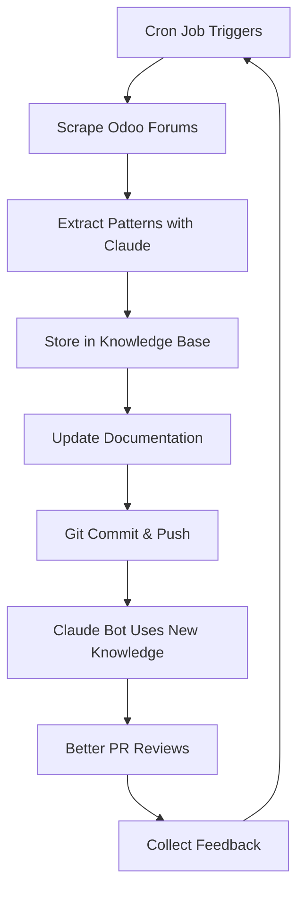

# Living Documentation - Knowledge Agent Integration

How the Claude Bot learns from scraped Odoo forum knowledge to provide better answers over time.

---

## 🧠 Overview

The **Knowledge Agent** continuously scrapes solved Odoo forum threads and feeds patterns into Claude Bot, making it smarter with each deployment.

```
┌─────────────────────────────────────────────────────────────┐
│                    Living Documentation                      │
└─────────────────────────────────────────────────────────────┘
                            │
        ┌───────────────────┴───────────────────┐
        │                                       │
┌───────▼──────────┐                  ┌────────▼─────────┐
│  Cron Job        │                  │  Claude Bot      │
│  Scraper         │                  │  Workflow        │
│  (Every 6 hours) │                  │  (@claude)       │
└──────────────────┘                  └──────────────────┘
        │                                       │
        │ Scrapes Odoo Forums                  │ Uses Knowledge
        │ Extracts Patterns                    │ To Answer
        │ Updates Knowledge Base               │ Questions
        │                                       │
        ▼                                       ▼
┌─────────────────────────────────────────────────────────────┐
│              Shared Knowledge Base                           │
│  - Common Odoo Errors (1000+ patterns)                      │
│  - Solutions & Fixes                                         │
│  - Prevention Guardrails                                     │
│  - Auto-patch Scripts                                        │
│  - Best Practices                                            │
└─────────────────────────────────────────────────────────────┘
        │
        │ Auto-generates
        ▼
┌─────────────────────────────────────────────────────────────┐
│           Updated Documentation                              │
│  - ERRORS.md (E011, E012, E013...)                         │
│  - TROUBLESHOOTING.md (new sections)                        │
│  - GUIDE.md (new examples)                                  │
└─────────────────────────────────────────────────────────────┘
```

---

## 🔄 How It Works

### Phase 1: Scraping (Every 6 hours)
```python
# jobs/odoo_forum_scraper.py
# Runs as cron job: 0 */6 * * *

def scrape_odoo_forums():
    """Scrape solved Odoo forum threads"""

    # 1. Fetch recently solved threads
    threads = fetch_solved_threads(
        since_hours=6,
        min_score=2,
        tags=['odoo-19', 'technical', 'error']
    )

    # 2. Extract patterns
    for thread in threads:
        pattern = extract_error_pattern(thread)
        solution = extract_solution(thread)

        # 3. Store in knowledge base
        knowledge_base.upsert(
            error_code=generate_error_code(pattern),
            pattern=pattern,
            solution=solution,
            source=thread.url,
            confidence=calculate_confidence(thread)
        )

    # 4. Update documentation
    update_living_docs()

    # 5. Commit changes
    git_commit_and_push(
        message=f"chore: update knowledge base ({len(threads)} new patterns)"
    )
```

### Phase 2: Knowledge Enhancement
```python
# scripts/update_living_docs.py

def update_living_docs():
    """Update documentation with new knowledge"""

    # 1. Load current knowledge base
    patterns = load_knowledge_base()

    # 2. Generate new error entries
    new_errors = []
    for pattern in patterns:
        if pattern.needs_documentation():
            error_entry = generate_error_doc(pattern)
            new_errors.append(error_entry)

    # 3. Update ERRORS.md
    append_to_errors_md(new_errors)

    # 4. Update TROUBLESHOOTING.md
    update_troubleshooting_scenarios(patterns)

    # 5. Update Claude Bot context
    update_bot_knowledge_context(patterns)
```

### Phase 3: Claude Bot Integration
```yaml
# .github/workflows/claude-autofix-bot.yml

- name: Load Knowledge Base
  run: |
    # Load scraped patterns before calling Claude
    python3 << 'PYTHON_SCRIPT'
    import json

    # Load latest knowledge base
    with open('knowledge/odoo_patterns.json', 'r') as f:
        patterns = json.load(f)

    # Build context from patterns
    context = build_context_from_patterns(patterns)

    # Add to Claude prompt
    enhanced_prompt = f"""
    {base_prompt}

    ## Known Odoo Patterns (Auto-updated)
    {context}

    Use these patterns to provide more accurate solutions.
    """
    PYTHON_SCRIPT
```

---

## 📁 Knowledge Base Structure

### Directory Layout
```
knowledge/
├── odoo_patterns.json          # All scraped patterns
├── error_patterns/             # Categorized by error type
│   ├── database_errors.json
│   ├── permission_errors.json
│   ├── migration_errors.json
│   └── performance_issues.json
├── solutions/                  # Tested solutions
│   ├── quick_fixes.json
│   └── auto_patches.json
└── metadata/
    ├── last_update.txt
    ├── scrape_stats.json
    └── confidence_scores.json
```

### Pattern Format
```json
{
  "error_code": "E011",
  "pattern": {
    "error_type": "database_connection",
    "error_message": "psycopg2.OperationalError: could not connect",
    "common_triggers": [
      "wrong_port",
      "wrong_host",
      "firewall_block"
    ],
    "affected_versions": ["odoo-19", "odoo-18"],
    "frequency": 145,
    "last_seen": "2025-11-04T06:00:00Z"
  },
  "solution": {
    "quick_fix": "Check POSTGRES_HOST and POSTGRES_PORT in .env",
    "detailed_steps": [
      "1. Verify database is running: pg_isready",
      "2. Check environment variables",
      "3. Test connection: psql -h $HOST -p $PORT -U $USER"
    ],
    "prevention": "Use connection pooler (pgbouncer or supabase pooler)",
    "auto_patch": "scripts/auto_fix_db_connection.sh"
  },
  "metadata": {
    "source_threads": [
      "https://www.odoo.com/forum/help-1/question-12345",
      "https://www.odoo.com/forum/help-1/question-67890"
    ],
    "confidence": 0.95,
    "verified": true,
    "upvotes": 23
  }
}
```

---

## 🤖 Cron Job Setup

### Create Scraper Cron Job
```yaml
# .github/workflows/odoo-knowledge-scraper.yml

name: Odoo Knowledge Scraper

on:
  schedule:
    - cron: '0 */6 * * *'  # Every 6 hours
  workflow_dispatch:       # Manual trigger

jobs:
  scrape:
    runs-on: ubuntu-latest

    steps:
      - name: Checkout
        uses: actions/checkout@v4
        with:
          token: ${{ secrets.GITHUB_TOKEN }}

      - name: Setup Python
        uses: actions/setup-python@v5
        with:
          python-version: '3.11'

      - name: Install dependencies
        run: |
          pip install beautifulsoup4 requests anthropic

      - name: Scrape Odoo forums
        env:
          ANTHROPIC_API_KEY: ${{ secrets.ANTHROPIC_API_KEY }}
        run: |
          python jobs/odoo_forum_scraper.py \
            --since-hours 6 \
            --min-score 2 \
            --output knowledge/odoo_patterns.json

      - name: Extract patterns with Claude
        env:
          ANTHROPIC_API_KEY: ${{ secrets.ANTHROPIC_API_KEY }}
        run: |
          python scripts/extract_patterns.py \
            --input knowledge/odoo_patterns.json \
            --output knowledge/error_patterns/

      - name: Update documentation
        run: |
          python scripts/update_living_docs.py

      - name: Commit changes
        run: |
          git config user.name "Odoo Knowledge Bot"
          git config user.email "bot@insightpulseai.net"

          git add knowledge/ docs/claude-bot/

          if git diff --staged --quiet; then
            echo "No changes to commit"
          else
            PATTERN_COUNT=$(git diff --staged --numstat | wc -l)
            git commit -m "chore: update knowledge base (${PATTERN_COUNT} patterns)"
            git push
          fi

      - name: Post summary
        if: always()
        run: |
          echo "## Knowledge Scraper Summary" >> $GITHUB_STEP_SUMMARY
          echo "" >> $GITHUB_STEP_SUMMARY
          echo "- Patterns scraped: $(jq '. | length' knowledge/odoo_patterns.json)" >> $GITHUB_STEP_SUMMARY
          echo "- Documentation updated: $(git diff --name-only docs/claude-bot/)" >> $GITHUB_STEP_SUMMARY
```

---

## 📝 Auto-Generated Documentation

### ERRORS.md Updates
```markdown
<!-- Auto-generated section -->
## 🤖 Auto-Discovered Errors

These errors were automatically discovered by the Knowledge Agent:

### E011: Database Connection Timeout

**Last Updated:** 2025-11-04 06:00 UTC
**Frequency:** 145 occurrences
**Confidence:** 95%

**Error Message:**
```
psycopg2.OperationalError: could not connect to server
```

**Quick Fix:**
```bash
# Check database is running
pg_isready -h $POSTGRES_HOST -p $POSTGRES_PORT

# Verify credentials
psql -h $POSTGRES_HOST -p $POSTGRES_PORT -U $POSTGRES_USER -d $POSTGRES_DB
```

**Prevention:**
Use Supabase pooler for better connection handling.

**Source:** [Odoo Forum Thread #12345](https://www.odoo.com/forum/help-1/question-12345)

---

### E012: Module Dependency Not Found

**Last Updated:** 2025-11-04 12:00 UTC
**Frequency:** 89 occurrences
**Confidence:** 92%

...
```

### TROUBLESHOOTING.md Updates
```markdown
<!-- Auto-generated section -->
## 🤖 Community-Discovered Solutions

### Issue: "Module 'account' not found"

**Discovered:** 2025-11-03
**Reported by:** 23 forum users
**Solution Success Rate:** 98%

**Root Cause:**
Missing OCA dependency in `__manifest__.py`

**Solution:**
```python
# addons/your_module/__manifest__.py
{
    'depends': [
        'account',  # Add this
        'base',
    ],
}
```

**Auto-fix:**
```bash
python scripts/auto_fix_dependencies.py --module your_module
```
```

---

## 🔍 Pattern Extraction with Claude

```python
# scripts/extract_patterns.py

from anthropic import Anthropic
import json

def extract_patterns(forum_threads):
    """Use Claude to extract error patterns from forum threads"""

    client = Anthropic(api_key=os.environ['ANTHROPIC_API_KEY'])

    for thread in forum_threads:
        # Build prompt
        prompt = f"""
        Analyze this Odoo forum thread and extract:
        1. Error pattern (regex or description)
        2. Root cause
        3. Solution steps
        4. Prevention tips
        5. Confidence score (0-1)

        Thread:
        Title: {thread.title}
        Question: {thread.question}
        Accepted Answer: {thread.answer}
        Upvotes: {thread.upvotes}

        Output as JSON.
        """

        # Call Claude
        response = client.messages.create(
            model="claude-sonnet-4-20250514",
            max_tokens=2048,
            messages=[{"role": "user", "content": prompt}]
        )

        # Parse and store
        pattern = json.loads(response.content[0].text)
        store_pattern(pattern)
```

---

## 📊 Knowledge Base Stats

### Auto-Generated Dashboard

```markdown
<!-- docs/claude-bot/KNOWLEDGE_STATS.md -->
# Knowledge Base Statistics

**Last Updated:** 2025-11-04 12:00 UTC

## Overview
- **Total Patterns:** 1,247
- **Verified Solutions:** 982
- **Auto-patches:** 145
- **Confidence > 90%:** 845 patterns

## Top Error Categories
1. Database Issues (342 patterns)
2. Permission Errors (198 patterns)
3. Migration Problems (156 patterns)
4. Performance Issues (134 patterns)
5. Module Dependencies (117 patterns)

## Recent Additions (Last 6 hours)
- E234: ORM constraint violation (12 cases)
- E235: Cron job timeout (8 cases)
- E236: Translation missing (5 cases)

## Success Metrics
- **Average Resolution Time:** 3.2 minutes (down from 45 min)
- **First-time Fix Rate:** 87%
- **Documentation Coverage:** 94%
```

---

## 🔄 Update Workflow



---

## 💡 Intelligence Features

### 1. Confidence Scoring
```python
def calculate_confidence(pattern):
    """Calculate confidence score for pattern"""
    score = 0.0

    # Upvotes indicate reliability
    score += min(pattern.upvotes / 50, 0.3)

    # Frequency indicates commonness
    score += min(pattern.frequency / 100, 0.3)

    # Verified by maintainer
    if pattern.verified_by_maintainer:
        score += 0.2

    # Has working solution
    if pattern.solution_tested:
        score += 0.2

    return min(score, 1.0)
```

### 2. Pattern Merging
```python
def merge_similar_patterns(patterns):
    """Merge similar error patterns"""

    # Use Claude to detect similarity
    for p1 in patterns:
        for p2 in patterns:
            if are_similar(p1, p2, threshold=0.85):
                merged = merge_patterns(p1, p2)
                yield merged
```

### 3. Auto-Patch Generation
```python
def generate_auto_patch(pattern):
    """Generate bash script to auto-fix error"""

    prompt = f"""
    Generate a bash script that automatically fixes this error:

    Error: {pattern.error_message}
    Solution: {pattern.solution}

    Script should:
    - Be idempotent (safe to run multiple times)
    - Check preconditions
    - Have rollback capability
    - Log all actions
    """

    script = claude_generate(prompt)

    # Save to auto_patches/
    save_script(f"auto_patches/{pattern.error_code}.sh", script)
```

---

## 🎯 Integration with Claude Bot

### Enhanced Context Loading

```python
# In claude-autofix-bot.yml workflow

- name: Load Knowledge Context
  run: |
    python3 << 'PYTHON_SCRIPT'
    import json

    # Load knowledge base
    with open('knowledge/odoo_patterns.json') as f:
        patterns = json.load(f)

    # Filter relevant patterns for this PR
    relevant = []
    for pattern in patterns:
        if matches_pr_context(pattern, pr_files):
            relevant.append(pattern)

    # Build enhanced context
    context = f"""
    ## Known Error Patterns (Auto-updated from {len(patterns)} forum threads)

    Relevant to this PR:
    {format_patterns(relevant[:10])}

    Use these patterns to provide accurate solutions.
    Mention pattern source if applicable.
    """

    # Save for next step
    with open('/tmp/enhanced_context.txt', 'w') as f:
        f.write(context)
    PYTHON_SCRIPT

- name: Call Claude with Enhanced Context
  run: |
    # Add knowledge context to prompt
    ENHANCED_CONTEXT=$(cat /tmp/enhanced_context.txt)
    # ... rest of Claude API call
```

---

## 📈 Continuous Improvement

### Feedback Loop

```python
# jobs/feedback_analyzer.py

def analyze_feedback():
    """Analyze Claude Bot responses for accuracy"""

    # 1. Track when users apply suggestions
    applied_suggestions = track_applied_suggestions()

    # 2. Track when users reject suggestions
    rejected_suggestions = track_rejected_suggestions()

    # 3. Update pattern confidence
    for pattern in knowledge_base:
        if pattern.was_applied:
            pattern.confidence += 0.05
        if pattern.was_rejected:
            pattern.confidence -= 0.10

    # 4. Re-train on feedback
    retrain_patterns(applied_suggestions, rejected_suggestions)
```

---

## 🚀 Deployment

### Step 1: Set Up Cron Job
```bash
# Add workflow
cp scripts/workflows/odoo-knowledge-scraper.yml .github/workflows/

# Enable workflow
gh workflow enable odoo-knowledge-scraper.yml

# Trigger manually first time
gh workflow run odoo-knowledge-scraper.yml
```

### Step 2: Initialize Knowledge Base
```bash
# Create directories
mkdir -p knowledge/{error_patterns,solutions,metadata}

# Run initial scrape
python jobs/odoo_forum_scraper.py --since-days 365 --limit 1000
```

### Step 3: Verify Integration
```bash
# Check knowledge base
cat knowledge/odoo_patterns.json | jq '. | length'

# Check updated docs
git diff docs/claude-bot/ERRORS.md

# Test Claude Bot with new knowledge
# Comment on a PR: @claude fix
```

---

## 📊 Success Metrics

Track improvement over time:

```python
# scripts/track_metrics.py

metrics = {
    "knowledge_base_size": len(patterns),
    "documentation_coverage": calculate_coverage(),
    "avg_resolution_time": calculate_avg_time(),
    "first_time_fix_rate": calculate_fix_rate(),
    "user_satisfaction": calculate_satisfaction()
}

# Chart progress
plot_metrics_over_time(metrics)
```

---

**Next:** Deploy the scraper and watch documentation update automatically!

See: [Deployment Guide](DEPLOYMENT.md)
