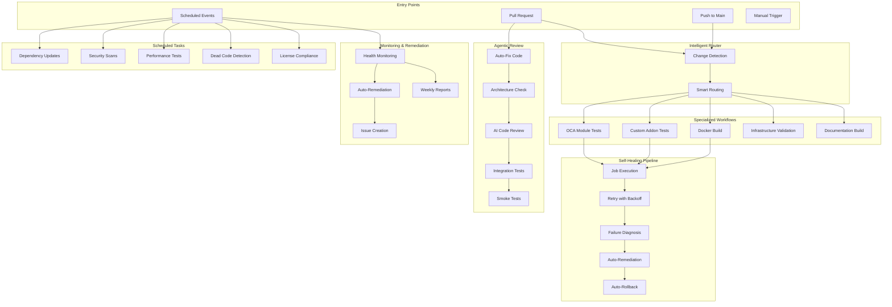

# Enterprise Workflow Automation Architecture

## Overview

This document describes the comprehensive, self-healing CI/CD automation system for the InsightPulse Odoo repository. The system implements five major components designed to work together for maximum reliability and efficiency.

## System Architecture



## Component Details

### 1. Self-Healing Pipeline (`.github/workflows/self-healing.yml`)

**Purpose**: Automatically retry failed jobs with intelligent backoff and recovery mechanisms.

**Key Features**:
- Exponential backoff retry logic (configurable, max 3 retries by default)
- Automatic failure diagnosis with root cause analysis
- Dependency conflict auto-resolution
- Automatic rollback on deployment failures
- Issue creation for unrecoverable failures
- Comprehensive diagnostic reporting

**Triggers**:
- Called by other workflows as a reusable workflow
- Manual dispatch for testing

**Outputs**:
- Job status (success/failed)
- Diagnostic report JSON
- Retry count and duration metrics

### 2. Intelligent Workflow Router (`.github/workflows/router.yml`)

**Purpose**: Detect changes and route to specialized workflows for parallel execution.

**Change Detection**:
- OCA modules (`addons/`)
- Custom addons (`custom_addons/`)
- Docker files (`Dockerfile*`, `docker-compose*`)
- Infrastructure (`terraform/`, `infra/`)
- Documentation (`docs/`, `*.md`)
- Workflows (`.github/workflows/`)
- Scripts (`scripts/`)
- Python code (`*.py`)
- JavaScript (`*.js`, `*.jsx`, `*.ts`, `*.tsx`)
- Database (`*.sql`, `migrations/`)

**Routing Logic**:
```yaml
OCA modules changed → oca-pre-commit.yml
Custom addons changed → ci-consolidated.yml
Docker changed → Docker build workflow
Infrastructure changed → Terraform validation
Documentation changed → docs-ci.yml
Workflows changed → Workflow validation
```

**Complexity Analysis**:
- Low: ≤3 files, ≤50 lines changed
- Medium: ≤10 files, ≤300 lines changed
- High: >10 files or >300 lines changed

**Smart Caching**:
- Python dependencies cached by `requirements.txt` hash
- NPM dependencies cached by `package-lock.json` hash
- Docker layers cached by `Dockerfile` hash
- Cache hit rate target: 90%

### 3. Scheduled Automations (`.github/workflows/scheduled.yml`)

**Purpose**: Automated maintenance, security, and health monitoring tasks.

**Schedule**:

| Task | Frequency | Time (UTC) | Description |
|------|-----------|------------|-------------|
| Dependency Updates | Daily | 02:00 | Update Python, npm, Odoo modules |
| Security Scans | Daily | 02:00 | Trivy, Safety, npm audit |
| Performance Tests | Weekly (Sun) | 03:00 | Regression tests vs baseline |
| Dead Code Detection | Weekly (Sun) | 03:00 | Find unused code |
| License Compliance | Monthly (1st) | 04:00 | Audit all dependencies |
| Migration Dry-Run | On-demand | - | Test DB migrations |

**Security Scanners**:
- **Trivy**: Container and filesystem vulnerability scanning
- **Safety**: Python dependency vulnerabilities
- **npm audit**: JavaScript dependency vulnerabilities

**Automated Actions**:
- Create draft PRs for dependency updates
- Upload security scan results to GitHub Security tab
- Create issues for high/critical vulnerabilities
- Generate cleanup issues for dead code
- Produce compliance reports for licenses

### 4. Agentic Code Review (`.github/workflows/agent-review.yml`)

**Purpose**: Automated code quality enforcement and intelligent review assistance.

**Workflow Stages**:


**Pre-Commit Auto-Fixes**:
- Remove unused imports (autoflake)
- Sort imports (isort)
- Format code (black)
- Auto-commit fixes with `[skip ci]`

**Architecture Compliance**:
- OCA module structure validation
- `__manifest__.py` presence check
- README.rst presence check
- BIR compliance checks for tax modules
- Philippines localization requirements

**Integration Tests**:
- PostgreSQL 16 test database
- Full Odoo module test suite
- Test coverage reporting
- Artifact upload for debugging

**Deployment Flow**:
```
PR merge → Staging deploy → E2E tests → Production promote
```

### 5. Monitoring & Auto-Remediation (`.github/workflows/monitor.yml`)

**Purpose**: Continuous production health monitoring with automatic healing.

**Monitoring Frequency**: Every 15 minutes

**Metrics Tracked**:
- Uptime (HTTP 200 check)
- Response time (target: <2000ms)
- Error rate (target: <5%)
- CPU usage (alert: >80%)
- Memory usage (alert: >85%)

**Alert Thresholds**:
```yaml
ALERT_THRESHOLD_RESPONSE_TIME: 2000  # milliseconds
ALERT_THRESHOLD_ERROR_RATE: 5        # percentage
ALERT_THRESHOLD_CPU: 80              # percentage
ALERT_THRESHOLD_MEMORY: 85           # percentage
```

**Auto-Remediation Actions**:
1. **High CPU** → Restart services
2. **High Memory** → Clear caches
3. **High Response Time** → Scale resources
4. **Service Down** → Restart + health check

**Escalation Path**:
```
Auto-heal attempt → Create GitHub issue → Notify on-call → Page if critical
```

**Weekly Health Reports**:
- Uptime percentage
- Average response time
- Error rate trends
- Incident summary
- Resource usage trends
- Recommendations

## Custom Composite Actions

### Smart Cache Action (`.github/actions/smart-cache/`)

Intelligent caching based on workflow type:

```yaml
- uses: ./.github/actions/smart-cache
  with:
    cache-type: python  # or npm, docker, general
    cache-key-prefix: ci-v1
```

**Cache Types**:
- **Python**: `~/.cache/pip`, keyed by `requirements*.txt`
- **NPM**: `~/.npm`, keyed by `package-lock.json`
- **Docker**: `/tmp/.buildx-cache`, keyed by `Dockerfile*`
- **General**: `~/.cache`, keyed by commit SHA

## Supporting Scripts

### CI Execution Script (`.github/scripts/ci/execute-job.sh`)

Unified job execution with error handling:

```bash
#!/bin/bash
# Usage: execute-job.sh <job-name>
# Jobs: test, build, lint
```

### Health Check Script (`.github/scripts/ci/health-check.sh`)

Post-healing verification:

```bash
#!/bin/bash
# Checks: Git repo, disk space, memory, critical files, Docker
```

## Configuration & Secrets

### Required Secrets

| Secret | Purpose | Example |
|--------|---------|---------|
| `GITHUB_TOKEN` | Automated PR/issue creation | Auto-provided |
| `ANTHROPIC_API_KEY` | AI-powered features | `sk-ant-...` |
| `PRODUCTION_URL` | Health monitoring endpoint | `https://app.example.com` |

### Environment Variables

```yaml
# Self-Healing
RETRY_BACKOFF_BASE: 2      # Exponential backoff multiplier
MAX_RETRY_DELAY: 300       # Max delay between retries (seconds)

# Monitoring
ALERT_THRESHOLD_RESPONSE_TIME: 2000  # milliseconds
ALERT_THRESHOLD_ERROR_RATE: 5        # percentage
ALERT_THRESHOLD_CPU: 80              # percentage
ALERT_THRESHOLD_MEMORY: 85           # percentage

# Caching
CACHE_VERSION: v1          # Increment to invalidate all caches
```

## Best Practices

### Idempotency

All workflows are designed to be safely retried:
- No destructive operations without confirmation
- State checks before applying changes
- Rollback mechanisms for failures

### Fail-Fast Principle

Maximum workflow runtime: 30 minutes
- Jobs timeout after 30 minutes
- Integration tests fail after 5 failures
- Early exit on critical errors

### Security

- Secrets managed via GitHub Secrets
- OIDC for cloud resource access
- SARIF uploads to Security tab
- Dependency vulnerability scanning

### Observability

- Comprehensive logging for all decisions
- Artifact uploads for debugging
- Step summaries in Actions UI
- Issue creation with runbook links

## Metrics & KPIs

### Target Metrics

| Metric | Target | Current |
|--------|--------|---------|
| Cache Hit Rate | 90% | TBD |
| Self-Healing Success Rate | 80% | TBD |
| Average Build Time | <10 min | TBD |
| False Positive Alert Rate | <5% | TBD |
| Mean Time to Remediation | <15 min | TBD |

### Monitoring Dashboards

Metrics available via:
- GitHub Actions insights
- Workflow run summaries
- Weekly health reports
- Custom Grafana dashboards (future)

## Troubleshooting

### Common Issues

**Q: Workflow stuck in retry loop**
A: Check diagnostic report in artifacts, may need manual intervention

**Q: Cache not hitting**
A: Verify cache key matches, increment `CACHE_VERSION` if needed

**Q: False positive alerts**
A: Adjust alert thresholds in `monitor.yml`

**Q: Auto-fix commits breaking tests**
A: Review auto-fix logic, may need to add file exclusions

### Runbooks

Detailed runbooks available in `docs/runbooks/`:
- `high-cpu.md` - CPU usage troubleshooting
- `high-memory.md` - Memory leak investigation
- `slow-response.md` - Response time optimization
- `service-restart.md` - Safe service restart procedure

## Migration from Current Workflows

### Phase 1: Parallel Run (Week 1-2)
- Keep existing workflows active
- Run new workflows in parallel
- Monitor for discrepancies
- Collect baseline metrics

### Phase 2: Gradual Cutover (Week 3-4)
- Disable redundant old workflows
- Route critical paths through new system
- Maintain fallback options
- Monitor success rates

### Phase 3: Full Migration (Week 5+)
- Deactivate all old workflows
- Archive for reference
- Update documentation
- Team training

## Future Enhancements

### Planned Features
- [ ] Machine learning for flaky test detection
- [ ] Predictive scaling based on metrics
- [ ] Cross-repository workflow orchestration
- [ ] Advanced cost optimization
- [ ] Multi-cloud deployment support

### Integration Opportunities
- Slack/Discord notifications
- PagerDuty/Opsgenie escalation
- Datadog/New Relic metrics
- Jira incident creation
- GitOps with ArgoCD/Flux

## Support & Feedback

For questions or issues:
1. Check this documentation
2. Review runbooks in `docs/runbooks/`
3. Create an issue with label `workflow-automation`
4. Contact DevOps team: @devops-team

---

**Last Updated**: 2024-11-09
**Version**: 1.0.0
**Maintainer**: InsightPulse DevOps Team
